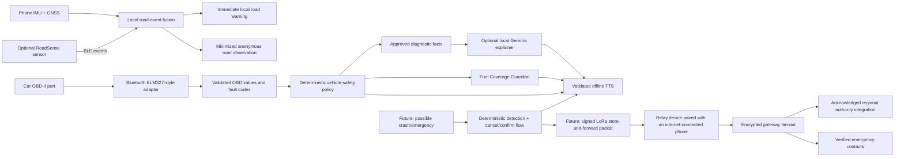
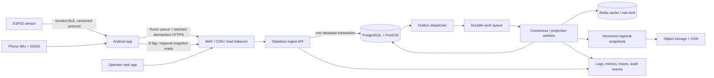
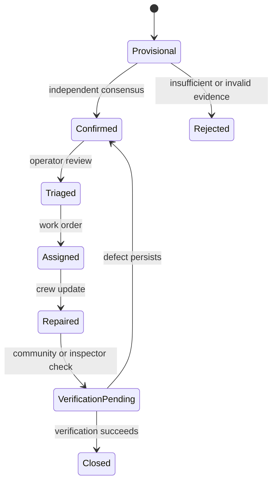

# MichiSonae Production Master Plan (RoadSense / Craterly)

**Version:** 1.5

**Prepared:** 2 August 2026

**Status:** Backend v1 and the dependency-light Android owner-alpha foundation
are implemented. Physical-device, road-calibration, live-provider and optional
hardware validation remain active release gates.
**Scope:** `Roadsense`, `Roadsense_hardware`, `Roadsense_Application`, and `Craterly`

## 1. Executive decision

The project should move forward as one product and one canonical repository:

- Use **`MichiSonae` as the canonical monorepo**. The product name and repository consolidation are complete.
- Treat the older `Roadsense`, `Roadsense_hardware`, and `Roadsense_Application` repositories as migration sources, then archive them as read-only.
- Use **one mobile client: native Kotlin/Jetpack Compose**. iOS, Flutter and a second active mobile stack remain out of scope.
- Make the first production release an **individual-driver product for Assam**: automatically detect driving, warn about potholes and rough roads, and remain useful without an external RoadSense device or a user account.
- Include **read-only OBD-II over Bluetooth** in the active Android scope. The phone connects to an adapter plugged into the car's OBD-II port. Present live vehicle data in simple language, classify trouble codes with a vetted deterministic policy, optionally use a constrained local model to explain those verified facts, recommend nearby service centers, and provide conservative low-fuel guidance based on current direction and nearby options.
- Make the optional RoadSense accessory and the phone **independent pothole/rough-road observers**. When both are available, fuse matching events into one stronger observation instead of generating duplicate warnings or reports.
- Give MichiSonae an optional **offline “car voice”**: short validated warnings and explanations are spoken through local Android text-to-speech. Gemma may simplify approved facts, but it never decides severity, fuel reachability, or emergency status.
- Keep **LoRa mesh networking on the future TODO list**. It is not part of the current implementation or launch path.
- Keep the implemented PostgreSQL **transactional outbox**, event idempotency and durable mobile upload queue as the source-of-truth path. Redis remains only a cache/transport optimization.
- Serve versioned hazard snapshots through a CDN so a large read audience does not translate directly into database traffic.
- Do not claim “production ready” from unit-test counts alone. Release readiness requires physical-device testing, real-road labeled data, privacy and Play policy review, load tests, disaster recovery tests, and measured service-level objectives.

The project owner has confirmed that the product is Android-only for the foreseeable future. The production client will stay native Kotlin/Jetpack Compose; iOS and Flutter are out of scope after required migration work is complete.

### 1.1 Implementation checkpoint — 2 August 2026

- Backend v1 has durable, idempotent observation ingestion, an outbox,
  retry-safe projection, cacheable regional snapshots, anonymous installation
  security, lifecycle operations, observability, backup/restore checks and an
  invited-alpha load gate.
- Android has automatic phone-only detection, a durable offline queue,
  background retry/recovery, offline hazard snapshots, strictly read-only
  ELM327 support, deterministic diagnostic/fuel policy, local warnings and
  stopped-only manual road-hazard reporting.
- Shared golden ingestion vectors and deterministic failure/fuzz simulators
  cover the Android/backend boundary without introducing generated-client or
  test-framework dependencies.
- Release policy checks reject committed secrets/endpoints, forbidden raw or
  diagnostic uploads, unsafe observation fields and ECU commands outside the
  reviewed Mode 01/03 read-only boundary.
- Owner-alpha release claims still require physical screen-off/OEM testing,
  labelled on-road calibration, real ELM327/car coverage, a reviewed live
  station/service provider, signed distribution and privacy/Play review.
- LoRa mesh, crash/SOS and authority delivery remain future work requiring the
  approved future-phase ADR; they are not v1 runtime modules.

## 2. Product aim reconstructed from the repositories

The four repositories collectively describe this product:

> RoadSense/Craterly is an account-free Android driving companion and crowdsourced road-intelligence platform. A phone detects road shocks and roughness without requiring external hardware; an optional ESP32 sensor can improve the signal. The backend combines independent observations into confidence-scored hazards and warns drivers before they reach them. An optional Bluetooth OBD-II adapter adds simple live vehicle information, fault-code explanations, conservative low-fuel guidance, and nearby service recommendations. Fleet and municipal products can later build on the same road data.

The expanded Craterly vision also includes OBD-II diagnostics, offline maps and points of interest, broader assistant features, emergency workflows, and future LoRa communication. Read-only Bluetooth OBD-II plus a narrowly constrained on-device diagnostic explainer are now part of the active Android product. A general assistant, emergency automation, and LoRa mesh remain later product lines and are not launch blockers.

### 2.1 End-to-end product operation



The runtime rules are:

1. The phone detects road events by itself. The accessory may also detect them; matching phone/device events are time-and-location fused into one event with recorded source evidence.
2. The phone communicates with the car only through a separately paired read-only OBD adapter. OBD support is discovered per vehicle; missing data falls back honestly instead of being invented.
3. Fuel guidance converts a validated or manually entered fuel level into a conservative **estimated road range**, then compares that range with road-network distance to known reachable stations. It never compares raw fuel percentage with straight-line distance.
4. Deterministic code owns warnings, severity, safe actions, range calculations, and emergency state. The local Gemma model may only explain the approved facts in simpler English.
5. Local text-to-speech reads the validated message so the experience can feel like the car is talking to the driver. Critical messages remain short, literal, and available even when the model is not installed.
6. The future LoRa mesh relays a signed distress packet between participating devices until it reaches a RoadSense device paired with an internet-connected phone. The relay phone forwards an end-to-end encrypted packet to a reviewed gateway that separately contacts the supported regional authority integration and the user's three configured emergency contacts. Each destination needs its own acknowledgement state.

### 2.2 Users and jobs to be done

| User | Primary job | Required outcome |
|---|---|---|
| **Individual driver or rider — primary** | Avoid dangerous road defects and understand basic vehicle condition without distraction | Timely road warnings plus clear, conservative OBD information |
| Data contributor | Let the system observe road condition with minimal effort | Consent-based collection, bounded battery/data use, reliable offline retry |
| Fleet operator — secondary | Protect vehicles and understand route quality | Route/fleet analytics without exposing individual drivers unnecessarily |
| Municipal operator — secondary | Find, rank, assign, and verify road repairs | Explainable severity/confidence, road segment, history, evidence, export/API |
| System operator | Run a trustworthy public service | Observable, recoverable, secure, cost-controlled platform |

### 2.3 North-star outcome

The north-star metric should not be “reports received.” It should be:

> **Driving sessions in which the user receives a useful, timely road warning or understandable vehicle warning without a false or distracting alert.**

Supporting metrics:

- precision and recall against manually labeled road events;
- false warnings per 100 km;
- median warning lead time by speed;
- successful automatic drive starts and false automatic starts;
- successful OBD connections and reconnections by supported adapter/vehicle;
- percentage of vehicle messages understood by users without technical knowledge;
- low-fuel recommendations that retain the configured safety range;
- percentage of reports accepted exactly once;
- active hazards with two or more independent sources;
- municipal time from detection to verification/closure;
- client crash-free and ANR-free rate;
- upload success within 24 hours for offline observations;
- cost per 1,000 active driving hours.

## 3. Repository audit and disposition

### 3.1 Repository verdict

| Repository | What it contains | Main issues | Disposition |
|---|---|---|---|
| [`Roadsense`](https://github.com/priencelucifer/Roadsense) | Cloudflare Pages/D1 backend, an Android client, web assets, and firmware | Prototype architecture; shared ingest secret; raw unbounded hazard reads; weak validation; no production auth/idempotency/consensus; mixed unrelated components | Preserve tag, migrate any unique assets/docs, then archive |
| `Roadsense_hardware` | ESP32 sketch, Fusion 360 files, STL exports | Credentials in history; insecure TLS; IP geolocation fallback; no BOM, wiring, calibration, revision, power, enclosure, or field-test documentation | Rotate credentials immediately; move sanitized CAD/firmware into Craterly; archive |
| `Roadsense_Application` | Android source plus a very large amount of generated build output | Approximately 345 MB current tree; APK/AAB/DEX/native libraries, Gradle caches, IDE state, local SDK path, and Mapbox secrets committed; source mostly duplicates `Roadsense` | Rotate tokens, purge secret history, extract only unique source/assets, then archive |
| [`Craterly`](https://github.com/priencelucifer/Craterly) | Flutter, FastAPI/Postgres/Redis backend, firmware, simulator, infrastructure, documentation, CI; native Android rewrite in [PR #2](https://github.com/priencelucifer/Craterly/pull/2) | Good consolidation, but important correctness and production gaps remain; duplicate mobile stacks; no real hardware transport in native app; infrastructure is development-grade | Make canonical; fix P0/P1 findings before beta |

### 3.2 Positive foundations in Craterly

- The project is already organized as a monorepo with backend, mobile, firmware, simulator, infrastructure, and documentation.
- Backend, Flutter, and detector test jobs are passing on the inspected main-branch workflow.
- The native Android rewrite has a passing backend/Flutter/firmware/Android workflow in its inspected PR run.
- The backend has a sensible starting stack: FastAPI, PostgreSQL/PostGIS, and Redis.
- H3 bucketing, offline behavior, driver warnings, simulation, and municipal use cases are already part of the design vocabulary.
- The native Android rewrite is modular and has JVM tests; it is a better Android-first base than maintaining a second historic Android application.

These are useful engineering foundations, not proof of production readiness. Current CI does not validate signed release builds, real Bluetooth hardware, road accuracy, mobile UI behavior, battery consumption, upgrades, backups, or large-scale load.

## 4. Stop-the-line actions: first 72 hours

These actions happen before new feature work.

### 4.1 Rotate exposed credentials

The audit found real-looking credentials in the hardware and application repositories:

- Wi-Fi credentials;
- a shared backend ingest secret;
- Mapbox tokens, including a secret-looking token;
- a developer-local Android SDK path.

Actions:

1. Revoke and reissue every affected credential at its provider.
2. Verify old credentials no longer authenticate.
3. Replace committed values with documented environment-variable names and safe examples.
4. Purge secrets from Git history using `git filter-repo` or an equivalent reviewed process.
5. Force collaborators to re-clone after history rewriting.
6. Enable GitHub secret scanning and push protection where the account plan permits it.
7. Add automated secret scanning, such as Gitleaks, to pull-request CI.
8. Never use fleet-wide secrets in firmware. Provision a distinct device identity or rely on app-mediated authenticated uploads.

Do not copy any exposed value into an issue, commit message, build log, or migration document.

### 4.2 Stop unsafe release behavior

- Remove offline/prefetch use of the standard OpenStreetMap tile service. The [OSM tile policy](https://operations.osmfoundation.org/policies/tiles/) explicitly prohibits offline and bulk downloading from `tile.openstreetmap.org`.
- Do not rely on the public Overpass service as a production content pipeline. Its [public-instance guidance](https://wiki.openstreetmap.org/wiki/Overpass_API) describes modest-use expectations, not a product SLA.
- Replace direct emergency-call claims. Android's [`CALL_PRIVILEGED`](https://developer.android.com/reference/android/Manifest.permission.html) permission, which can call emergency numbers without user interaction, is unavailable to ordinary third-party applications. A normal app should open a user-confirmed dialer unless operating through an approved emergency partner.
- Remove production release defaults that point to emulator-local HTTP endpoints.
- Add a release-build guard that fails when an endpoint is HTTP, localhost, `10.0.2.2`, or a placeholder.
- Disable automatic file-system formatting on firmware startup until power-loss-safe recovery behavior exists.

### 4.3 Freeze repository sprawl

- Add a banner to the three legacy READMEs: “Archived migration source; development continues in Craterly.”
- Disable Actions and package publication in the legacy repositories after migration.
- Freeze Flutter feature development. Migrate required behavior into native Android and implement all new production features in Kotlin.
- Create a protected `main` branch in Craterly with required checks and reviewed pull requests.

## 5. Product scope and sequencing

### 5.1 Production v1

The v1 release should include:

- account-free use with an upgradeable anonymous installation identity;
- automatic driving-session detection, with clear first-time consent, a visible active notification, manual start/stop fallback, and false-start protection;
- cars as the only supported vehicle class in v1;
- phone IMU collection with device-specific calibration;
- phone-only pothole and rough-road detection that works without any external RoadSense hardware;
- adaptive hazard classification and warning distance based on current speed and a vehicle risk profile;
- combined English voice, warning sound, and vibration alerts, tested so the combination is noticeable without being distracting;
- one-time contribution consent followed by automatic anonymous upload of minimized road observations;
- stopped-user manual reporting and confirmation of general road hazards, not a pothole-only form;
- read-only OBD-II connection from a supported Bluetooth adapter to the Android phone;
- durable OBD connection state, adapter discovery, vehicle profile, supported-PID discovery, and safe reconnect behavior;
- a simple live-vehicle screen that translates supported values into plain language;
- a calm default vehicle summary with detailed gauges available only behind an explicit user action;
- diagnostic-trouble-code reading with likely meaning, urgency, uncertainty, and an explicit statement that it is not a confirmed mechanical diagnosis;
- deterministic safety classification first, with an optional entirely on-device AI explanation over a vetted local diagnostic knowledge base;
- local wake-word activation during an explicitly enabled voice session, followed by local destination/command recognition with no server audio upload; retain microphone-button, typed, and share fallbacks;
- nearby service-center suggestions based on location, route, opening/availability data when known, and user choice;
- conservative estimated fuel range and an upcoming-fuel-station recommendation when the vehicle exposes sufficient data and the map data is reliable;
- background road warnings while the user uses Google Maps or another navigation application;
- one-tap launch of a selected fuel station or service center in Google Maps rather than an in-app turn-by-turn navigation engine;
- authenticated ESP32-to-phone Bluetooth ingestion;
- GNSS location supplied by the phone, with firmware GNSS as an optional corroborating source;
- durable on-device event queue and batched, idempotent uploads;
- server-side consensus, confidence, aging, and resolution;
- road-segment-aware warning selection;
- offline storage of nearby hazard snapshots;
- audio/haptic warnings with no touch required while driving;
- privacy controls, account deletion, telemetry controls, and operational monitoring.

V1 explicitly does not retain trip history. The application may keep only the short-lived location and motion state required for the active warning session, plus minimized hazard observations that the user has consented to contribute.

Manual reporting must be disabled while the app believes the user is driving unless the interaction is safely completed by a passenger. The alpha includes all confirmed categories: road damage/pothole, rough road, obstruction/debris, flooding/waterlogging, open or damaged manhole, construction, and disabled vehicle. Keep the interface short by presenting a few grouped top-level choices and revealing subcategories only after the vehicle is stopped. Store the taxonomy as versioned configuration so categories, labels, icons, severity prompts, and regional availability can evolve without hard-coding them into each screen.

The initial application language is English. Text, speech, units, place formatting, and schemas should still be internationalization-ready so additional languages and regional units can be added without redesigning the application.

### 5.2 Beta-only or experimental

- route-quality scores;
- limited offline region packs supplied through a licensed/self-hosted vector-tile pipeline;
- fleet summaries and a municipal/operator dashboard;
- fleet API integrations.

### 5.3 Deferred until explicit gates are passed

- automated emergency dispatch, calls, or SMS;
- crash detection and SOS behavior until the later safety-validation phase;
- unconstrained, cloud-generated, or safety-authoritative diagnostic/driving advice from an LLM;
- arbitrary model downloads from third-party model hubs;
- LoRa mesh networking, including relay routing, store-and-forward, gateways, and regional spectrum/certification work;
- predictive vehicle-maintenance claims;
- public authority repair automation;
- iOS and Flutter production development.

The core product earns the right to add these features after the detection system is accurate, operationally reliable, and used in a real pilot.

## 6. Decisions required from the owner

These decisions should be recorded as Architecture Decision Records in the first week.

| ID | Decision | Recommended default | Decision deadline |
|---|---|---|---|
| D-01 | Public product name | **Confirmed working name: `MichiSonae`; public adoption remains conditional on native-language, trademark, domain, package, and store-name clearance** | Before public beta assets |
| D-02 | Launch geography | **Confirmed: 10-person Guwahati alpha, with worldwide English-language availability as the long-term target** | Decided |
| D-03 | Launch client | **Confirmed: Android native Kotlin/Compose** | Decided |
| D-04 | iOS at launch | **Confirmed: no iOS** | Decided |
| D-05 | Primary user | **Confirmed: individual drivers first; fleet and municipal products are secondary** | Decided |
| D-06 | Hardware model | **Confirmed: optional accessory; phone-only detection is mandatory** | Decided |
| D-07 | Map provider | Self-hosted/licensed vector packs with documented offline rights | Before beta |
| D-08 | Anonymous use | **Confirmed: the core application works without an account, using an upgradeable installation identity** | Decided |
| D-09 | Data retention | Raw location observations short-lived; aggregates longer-lived | Before pilot consent |
| D-10 | Crash/SOS features | **Confirmed: future scope, not current v1** | Decided |
| D-11 | Driving-session start | **Confirmed: automatic, with consent, notification, false-start controls, and manual fallback** | Decided |
| D-12 | Initial OBD adapter | **Confirmed first fixture: inexpensive Bluetooth ELM327-style clone; formally supported adapter models remain conditional on compatibility/reliability evaluation** | Decided for owner alpha |
| D-13 | Initial vehicle class | **Confirmed: cars only** | Decided |
| D-14 | Navigation role | **Confirmed: background warning companion; open Google Maps for user-selected navigation** | Decided |
| D-15 | Uncertain automatic start | **Confirmed: ask through a notification when driving confidence is uncertain** | Decided |
| D-16 | Fault-code scan | **Confirmed: automatic and user-requested scan modes** | Decided |
| D-17 | Vehicle profile | **Confirmed: user may enter make/model/year, tank capacity, and mileage** | Decided |
| D-18 | Service-center choice | **Confirmed: show alternatives and current opening information when available; user chooses** | Decided |
| D-19 | Trip history | **Confirmed: do not build or retain trip history** | Decided |
| D-20 | V1 language | **Confirmed: English only** | Decided |
| D-21 | Road warning output | **Confirmed: combined voice, warning sound, and vibration** | Decided |
| D-22 | Hazard sensitivity | **Confirmed: adapt by speed and a vehicle risk profile, not a single global threshold** | Decided |
| D-23 | Community contribution | **Confirmed: consent once, then upload minimized anonymous road observations automatically** | Decided |
| D-24 | OBD presentation | **Confirmed: distraction-free summary by default; detailed gauges behind an explicit button** | Decided |
| D-25 | Serious vehicle warning | **Confirmed: persistent warning with a safe-stop recommendation until acknowledged/resolved** | Decided |
| D-26 | Initial business model | **Confirmed: none for the alpha** | Decided |
| D-27 | Alpha size | **Confirmed: 10 invited testers; use minimal infrastructure** | Decided |
| D-28 | First test fixtures | **Confirmed: project owner, Nothing Phone (1) on approximately Android 14, and approximately 2017 petrol automatic WagonR; fixtures only, never product-specific dependencies** | Decided |
| D-29 | Alpha OBD hardware | **Confirmed: inexpensive Bluetooth ELM327-style clone, treated as one test adapter until its transport/version/capabilities are identified** | Decided |
| D-30 | Automatic fault scanning | **Confirmed: scan on relevant engine/MIL state change and on user request; poll required live fuel inputs separately** | Decided |
| D-31 | Alpha start date | **Gate-based: begin when the alpha readiness checklist passes, not on an arbitrary date** | Decided |
| D-32 | Alpha operating budget | **Confirmed: USD 5–10 per month** | Decided |
| D-33 | Fuel coverage warning | **Confirmed launch-critical feature: warn when no known reachable fuel station is found ahead; provide selectable alternatives** | Decided |
| D-34 | Manual road report | **Confirmed: allow a stopped user to report general road hazards, not only potholes** | Decided |
| D-35 | Device independence | **Confirmed: use public Android APIs and a supported-device matrix; no Nothing-specific behavior** | Decided |
| D-36 | Vehicle independence | **Confirmed: capability-driven OBD and editable vehicle profiles; no WagonR-specific product logic** | Decided |
| D-37 | Fuel reserve | **Confirmed: automatic conservative combination of minimum distance, percentage, and uncertainty margin** | Decided |
| D-38 | Manual hazard taxonomy | **Confirmed: include every initially proposed category, grouped into a distraction-safe interface** | Decided |
| D-39 | Alpha tuning traces | **Confirmed: opt-in raw phone-motion and OBD traces remain local and auto-delete seven days after capture, with immediate user deletion available; the v1 server rejects raw trace/diagnostic uploads** | Decided |
| D-40 | Manual report media | **Confirmed: no images in the alpha; use structured category, severity, and location fields** | Decided |
| D-41 | Destination input | **Confirmed: support share-from-maps, on-device favorites, and speak/type-before-driving flows** | Decided |
| D-42 | Warning audio focus | **Confirmed: request a temporary pause of other media and allow it to resume after the warning** | Decided |
| D-43 | Fuel-level fallback | **Confirmed: prefer a validated supported OBD fuel-level value; otherwise request manual setup/update without making the app vehicle-specific** | Decided |
| D-44 | Manual fuel input | **Confirmed: stopped-only input offers gauge fractions and optional liters** | Decided |
| D-45 | Alerts during calls | **Confirmed: normal alerts use vibration plus notification during a call; spoken interruption is reserved for critical danger when the platform permits it** | Decided |
| D-46 | Fuel PID dropout | **Confirmed: briefly estimate from the last valid value using a larger safety margin, clearly label it as an estimate/data-uncertain, then degrade to a simple warning** | Decided |
| D-47 | Diagnostic AI | **Confirmed: use a constrained on-device model such as a benchmarked Gemma-family variant; never send OBD diagnostic data to a MichiSonae AI server** | Decided |
| D-48 | Destination speech | **Confirmed: transcription runs locally; do not use cloud speech recognition, and retain typed/share fallbacks** | Decided |
| D-49 | Hazard lead time | **Confirmed starting target: adaptive approximately 6–10 seconds, earlier at higher speed and validated by field tests** | Decided |
| D-50 | Warning feedback | **Confirmed: ask “Was that warning useful?” only occasionally after the car stops, with fatigue controls** | Decided |
| D-51 | Dual road detection | **Confirmed: phone and optional RoadSense device both detect potholes/roughness; the app fuses matching detections without making the device mandatory** | Decided |
| D-52 | Spoken vehicle experience | **Confirmed: validated local TTS makes the experience feel like the car is speaking; critical facts and actions remain deterministic, with Gemma limited to explaining approved facts** | Decided |
| D-53 | Future emergency mesh | **Confirmed future direction: a RoadSense device may relay signed crash/emergency packets through other devices over LoRa; no launch scope and no “help contacted” claim without gateway/provider acknowledgement** | Decided |
| D-54 | Local model delivery | **Confirmed: an optional approximately 600 MB local model download is acceptable; use a larger model only when measured quality justifies its device cost** | Decided |
| D-55 | Moving AI detail | **Confirmed: detailed AI explanations are stopped-only; moving drivers receive short deterministic messages** | Decided |
| D-56 | Voice activation | **Confirmed: wake phrase “Hey Michi,” with selectable `Manual only`, `App visible`, and `Active drive` modes; the owner meant the display locks/goes dark, so active-drive listening should continue screen-off through a visible permission-compliant service** | Decided |
| D-57 | Fault-card retention | **Owner delegated the choice: keep minimized fault cards locally, mark them “not currently detected” only after cautious rescan criteria, auto-delete inactive cards after 30 days, and allow immediate deletion** | Decided |
| D-58 | Voice style | **Confirmed: offer both friendly car-style and neutral MichiSonae narration; safety-critical wording remains reviewed and provenance-aware in both styles** | Decided |
| D-59 | Future emergency recipients | **Confirmed: relay until a RoadSense device has an internet-connected paired phone, then send encrypted GPS/required incident data to supported authorities and the user's three configured emergency contacts, with separate acknowledgements** | Decided for future architecture |
| D-60 | Emergency-contact count | **Confirmed: exactly three configured emergency contacts; recipients do not pre-accept, but numbers are owner-confirmed and recipients can block/opt out of future messages** | Decided for future emergency profile |
| D-61 | Mesh relay participation | **Confirmed: automatic relay is a key built-in function of future mesh-capable RoadSense hardware, with no app enable/disable toggle and no per-incident prompt; behavior is disclosed before activation/pairing** | Decided with unavoidable power/OS controls |
| D-62 | Crash cancellation | **Confirmed starting point: 30-second cancel countdown when the occupant appears responsive, followed by closed-course validation and accessibility testing** | Decided for future alpha |
| D-63 | Emergency hardware power/GNSS | **Confirmed future prototype: use phone GNSS plus cached recent coordinates, add a small emergency transmission energy reserve, and defer a separate GNSS receiver until tests justify it** | Decided for future prototype |
| D-64 | Emergency fan-out | **Confirmed: notify all three configured contacts in parallel while independently contacting the supported regional authority integration** | Decided for future emergency gateway |
| D-65 | Contact health | **Confirmed: a blocked or repeatedly failing contact makes emergency setup degraded and requires owner replacement; remaining valid destinations still receive an incident** | Decided for future emergency profile |
| D-66 | Mesh health UI | **Confirmed: provide privacy-safe device LED/app states for `mesh ready`, `gateway available`, `relay-only`, and `fault`** | Decided for future hardware |
| D-67 | Relay without internet | **Confirmed: when its paired phone lacks internet, a device remains a LoRa relay toward other vehicles and reports `relay-only`, never `gateway available`** | Decided for future mesh |

The remaining mobile migration decision is no longer about platforms. It is a parity checklist: preserve any valuable Flutter behavior, implement it in Kotlin, tag the Flutter baseline, and then remove Flutter from active development.

### 6.1 Preliminary global product-name search

Obvious candidates close to the current concept were rejected because active uses already exist. Examples include [Sentrive](https://www.sentrive.ai/), [VeyPath](https://veypath.com/en/), [Rovelio](https://rovelio.shop/), [Paventra](https://paventra.in/), and [Roventra](https://roventra.de/).

The first two coined shortlists were rejected by the owner. A fresh exact-name search also found [ViaSalus](https://viasalus.in/), an active Indian road-safety company working on real-time hazard awareness and crowdsourced road intelligence. Reject `ViaSalus` and confusingly similar safety/mobility names.

The third preliminary shortlist on 27 July 2026 produced the name selected by the owner on 28 July 2026:

| Candidate | Language inspiration and meaning | Assessment |
|---|---|---|
| **ViaCerno** | Coined Latin-inspired: `via` means road/way; `cerno` carries the sense of discerning or perceiving | Strong backup candidate |
| **IterCerno** | Coined Latin-inspired: `iter` means journey/road + `cerno` (discern/perceive) | Distinctive and technically meaningful, but pronunciation is less immediate |
| **ViaMonere** | Coined Latin-inspired: `via` (road/way) + `monere` (warn/advise) | Most directly connected to warnings, but longer and more formal |
| **MichiSonae** | Japanese-inspired: `michi` (road/way) + `sonae` (preparation/provision/guarding) | **Selected working name:** matches the product’s purpose of preparing drivers for road, fuel, and vehicle risks |

Dictionary support: Latin [`iter`](https://latin-dictionary.net/definition/24837/iter-itineris) means journey, path, or road; the Lewis and Short entry for [`monere`](https://atlas.perseus.tufts.edu/dictionaries/entry/urn%3Acite2%3Ascaife-viewer%3Adictionary-entries.atlas_v1%3Alat.ls.perseus-eng2-n29544/) includes advise and warn; the preliminary `cerno` sense is discern/perceive; and Japanese [`sonae`](https://www.japandict.com/%E5%82%99%E3%81%88) includes preparation, provision, or guarding. These are coined brand combinations, not claims that the full names are classical Latin or natural Japanese phrases.

Preliminary exact-name web, Play/App-Store-indexed, and GitHub-indexed searches on 28 July 2026 did not surface an obvious relevant exact `MichiSonae` product collision. RDAP returned no record at that moment for `michisonae.com`, `michisonae.app`, or `michisonae.in`. This is neither legal clearance nor a promise of availability; registrations and search results can change immediately. A native Japanese speaker must also review the coined combination before public launch.

Recommended working identity:

- **Name:** MichiSonae
- **Pronunciation:** “mee-chee soh-nah-eh”
- **Tagline:** “Ready for the road ahead.”
- **Positioning:** An automatic road and vehicle warning companion

Before public adoption:

1. Run formal exact and confusingly-similar trademark searches in intended launch classes and countries.
2. Have trademark counsel assess automotive/software/safety conflicts.
3. Recheck and register the preferred domain and key social handles.
4. Verify Google Play listing and Android package-name availability.
5. Do not rename repositories, packages, or public assets until the owner approves the name and clearance is complete.

## 7. Canonical repository layout

Use a single monorepo with clear ownership boundaries:

```text
craterly/
  apps/
    android/                  # One production mobile application
    operator-web/             # Municipal/operator dashboard
  services/
    api/                      # Public/control API
    worker/                   # Projection, consensus, notifications
  packages/
    contracts/                # OpenAPI/protobuf schemas and generated clients
    detection-spec/           # Golden traces, expected events, algorithm notes
    design-system/            # Shared visual tokens where useful
  firmware/
    esp32/
      src/
      test/
      boards/
      partitions/
  hardware/
    cad/
    enclosure/
    bom/
    wiring/
    manufacturing/
    validation/
  data/
    fixtures/
    synthetic/
    schemas/
  simulator/
  infra/
    dev/
    staging/
    production/
  docs/
    adr/
    product/
    operations/
    privacy/
    testing/
  tools/
```

Repository rules:

- Do not commit build output, IDE state, local properties, credentials, SDKs, model weights, downloaded maps, databases, APKs/AABs, firmware binaries, or generated dependency caches.
- Publish release artifacts through GitHub Releases, an artifact registry, or object storage.
- Use Git LFS only for genuinely source-controlled CAD assets and approved golden test traces, not generated binaries.
- Add `CODEOWNERS`, pull-request templates, issue templates, dependency update automation, and a security policy.
- Keep protocol and API contracts versioned independently from implementation.

## 8. Target production architecture



### 8.1 Principles

1. PostgreSQL is authoritative for accepted observations, device/account state, current hazard projections, operator actions, and audit history.
2. An observation and its outbox message are committed in one transaction.
3. Every event has a globally unique idempotency key.
4. All workers are safe to retry and can rebuild projections from retained source data.
5. Redis accelerates rate limits, locks, and hot reads but is not the only copy of irreplaceable data.
6. Public hazard reads are cacheable; sensitive account and operator APIs are not.
7. Large offline assets and public regional snapshots live in object storage behind a CDN.
8. Raw high-rate phone-motion, audio, and OBD diagnostic samples remain on the device in v1; the backend accepts only approved minimized derived road observations.
9. Each production behavior has a measurable SLO, an alert, an owner, and a recovery procedure.

## 9. Reliable observation-ingestion design

The current Craterly ingest sequence writes a row, publishes to Redis, and then commits PostgreSQL. That is not atomic. A worker can receive the message before the row exists, or Redis can receive an event whose database transaction later fails. Retrying can then double count an observation.

### 9.1 Required event envelope

```json
{
  "schema_version": 1,
  "event_id": "018f...uuidv7",
  "installation_id": "opaque-id",
  "source_id": "phone-or-sensor-id",
  "boot_id": "random-per-boot-id",
  "sequence": 123456,
  "detected_at": "2026-07-27T12:34:56.789Z",
  "received_location": {
    "latitude": 12.9716,
    "longitude": 77.5946,
    "accuracy_m": 7.2,
    "speed_mps": 8.4,
    "bearing_deg": 142.0
  },
  "classification": {
    "kind": "pothole",
    "severity": 0.72,
    "model_version": "phone-detector-3",
    "calibration_version": "pixel-7a-2"
  },
  "protocol_version": 2,
  "privacy_flags": {
    "raw_trace_included": false
  }
}
```

The v1 API must reject envelopes or multipart attachments containing raw IMU, voice, or OBD diagnostic traces. Local AI and detector tuning storage are separate device-only concerns.

Use UUIDv7/ULID or an equivalently sortable global identifier. Firmware should use at least a 32-bit sequence plus a random boot identifier; 64-bit is preferable. A persisted 16-bit sequence will wrap during the product lifetime.

### 9.2 Transactional request path

1. Authenticate the installation/device and evaluate rate/abuse limits.
2. Validate schema, coordinates, accuracy, allowed age, model version, and batch size.
3. Start a PostgreSQL transaction.
4. Insert the event using `UNIQUE (event_id)` and a second defensive unique key such as `(source_id, boot_id, sequence)`.
5. If the event already exists, return its original accepted state without creating another outbox entry.
6. Insert an outbox row containing the event identity and projection type.
7. Commit.
8. Return per-event results so the client deletes only durably accepted or permanently rejected events.
9. A dispatcher publishes undispatched outbox rows to the queue and marks them with a delivery attempt.
10. Projection workers upsert state idempotently and record their processed event IDs.

The API can acknowledge once PostgreSQL commits. Queue delivery may happen milliseconds later without making the mobile upload dependent on Redis availability.

### 9.3 Queue behavior

Redis Streams can work at early scale if operated correctly. Consumer groups are at-least-once, so workers still require idempotency. Use:

- unique consumer names per process;
- `XAUTOCLAIM` or an equivalent stale-message recovery path;
- bounded stream length plus PostgreSQL outbox retention;
- retry count, exponential delay, poison-message quarantine, and a dead-letter view;
- lag, oldest pending age, retry, and dead-letter alerts;
- Redis authentication, TLS, high availability, and persistence in production.

The relevant Redis behavior is documented in [Redis Streams](https://redis.io/docs/latest/develop/data-types/streams/) and [`XAUTOCLAIM`](https://redis.io/docs/latest/commands/xautoclaim/).

Move to a dedicated durable broker such as NATS JetStream, Kafka, or a managed queue only when measurements show that the outbox/Redis design cannot meet throughput, retention, ordering, or multi-region requirements. Do not add Kafka merely to make the architecture look “large.”

### 9.4 Time and replay rules

- Reject events too far in the future.
- Quarantine or down-weight events older than the configured offline window; do not let a replayed old observation make a hazard “recent.”
- Store both `detected_at` and `received_at`.
- Calculate freshness from trusted event time with bounded clock-skew handling.
- Sign server responses or use TLS plus standard token security; a client timestamp signature alone is replayable during its acceptance window unless it includes a nonce/request body and server replay cache.

## 10. Data model and geospatial projection

### 10.1 Core entities

| Entity | Purpose | Important keys |
|---|---|---|
| `installation` | Upgradeable anonymous or account-linked app identity | `installation_id`, attestation/trust state |
| `sensor` | A provisioned physical device | `sensor_id`, public key, firmware/hardware revision |
| `observation` | Immutable accepted road event | `event_id`, source/boot/sequence unique key, detected time |
| `observation_outbox` | Reliable projection work | `outbox_id`, event ID, status/attempts |
| `road_segment` | Map-matched road identity | provider/version/segment ID, geometry |
| `hazard_cluster` | Current logical defect or rough segment | type, road segment, location, lifecycle |
| `hazard_projection` | Read-optimized current state | cluster, confidence, severity, contributors, freshness |
| `operator_action` | Triage/assign/repair/verify workflow | actor, transition, reason, time |
| `regional_snapshot` | Versioned public read artifact | region, version, ETag, object URI |
| `audit_event` | Security and operator accountability | actor, action, resource, trace ID |

### 10.2 H3 and road segments

H3 should be a spatial indexing tool, not the product's only notion of “same road.” Use:

- fine cells to find nearby raw observations;
- road-map matching to separate parallel roads, flyovers, service lanes, and opposite carriageways;
- road-segment identity for driver-warning relevance and municipal repair workflow;
- coarser regional cells/tiles for cache keys and downloadable snapshots.

Current H3 reference data gives an average resolution-9 edge length of about 200.8 m and resolution-12 edge length of about 10.8 m. A small `k` ring at resolution 9 is therefore not automatically a reliable 3 km look-ahead corridor. Use a speed- and route-aware buffered corridor or compute the required rings from measured geometry. See the current [H3 resolution table](https://h3geo.org/docs/core-library/restable/) and [H3 miscellaneous API metrics](https://h3geo.org/docs/api/misc/).

Do not make a table's primary key only `h3_cell` when more than one hazard type, road segment, or model projection can exist in a cell. Use a composite or surrogate key with explicit uniqueness.

### 10.3 Retention

Start with an explicit policy, subject to legal review:

| Data | Suggested initial retention | Notes |
|---|---:|---|
| Rejected request body | None by default | Keep only structured reason/counts |
| High-rate sensor/OBD tuning trace | Device-only; 7 days from capture, opt-in | Never upload in v1; encrypt locally, exclude from backup, and support immediate deletion |
| Destination voice audio | In-memory until local transcription finishes | Never upload or retain the recording; retain destination text only for the active session |
| Precise raw observation | 30–90 days | Needed for model audit/reprojection; minimize identity linkage |
| Aggregated road hazard | While active + historical operational period | Coarsen/archive after closure |
| Security/audit event | 1 year or required contractual period | Restrict access |
| Operator repair evidence | Contract/policy-defined | May need longer municipal retention |
| Account/profile | Until deletion/contract need | Propagate deletion to derived personal data where feasible |

Partition `observation` by time, and optionally by geography at later scale. Test retention deletion and archival; a policy that is never executed is not a policy.

## 11. Consensus, confidence, and trust

The confidence system must be explainable and resilient to duplicate devices, repeated passes, malicious reports, and the empty-network cold start.

### 11.1 Initial consensus rules

For potholes:

- map an observation to a candidate road segment and spatial cluster;
- deduplicate repeated events from the same source within distance/time bounds;
- count independent installations/sensors, not packets;
- require two independent sources for “provisional” and three suitably trusted sources for “confirmed,” unless an operator verifies it;
- combine severity robustly using a weighted median or trimmed estimator;
- reduce weight for poor GNSS accuracy, implausible speed, stale events, uncalibrated models, and correlated sources;
- decay confidence as a function of time and road usage, but calculate decay lazily from timestamps rather than updating every row hourly;
- resolve after enough recent smooth traversals by independent trusted sources or an operator-verified repair.

For roughness:

- aggregate by road segment and direction over a distance window;
- send one summary per segment/window rather than a packet every few seconds;
- use distribution statistics, vehicle/device calibration, and minimum traversal length;
- avoid presenting a single transient bump as a persistent rough-road score.

### 11.2 Cold-start policy

The current trust design starts new devices below the activation threshold and needs already trusted owners to bootstrap trust. A new deployment can therefore wait days or require hidden manual seeding.

Use an explicit bootstrap state:

- an initial cohort of verified pilot installations/sensors;
- operator-verified labeled routes;
- a lower-confidence “community unverified” tier that can become provisional but not generate high-severity alerts alone;
- staged trust increases based on agreement with independent sources and stable behavior;
- no trust increase based only on account age;
- Play Integrity or equivalent attestation as one abuse signal, not as proof that a road observation is true.

Google describes the [Play Integrity API](https://developer.android.com/google/play/integrity/overview) as a way to evaluate genuine app/device and tampering signals. Keep a fallback for legitimate devices that cannot produce a strong verdict.

### 11.3 Model governance

- Version detector, calibration, firmware, and consensus models in every observation/projection.
- Maintain golden sensor traces with consent and documented labels.
- Keep a model card: input assumptions, tested devices/vehicles, limits, and evaluation data.
- Shadow new models before they affect warnings.
- Support rollback and reprojection.
- Report accuracy by device model, mount position, vehicle class, road surface, speed band, weather, and city.
- Never train on production personal data without a documented lawful basis, consent where required, minimization, and retention.

## 12. Read path and high-concurrency design

### 12.1 Do not send every user to PostgreSQL

Drivers in the same area request substantially the same hazard data. Generate a versioned regional snapshot and let the CDN absorb the fan-out.

Example public read contract:

```http
GET /v1/regions/{region_id}/hazards?version=2026-07-27T12:35:00Z
If-None-Match: "region-version-hash"
```

Response behavior:

- public, anonymous, coarse-enough hazard data;
- `ETag` and `304 Not Modified`;
- short `max-age`, longer `stale-while-revalidate`;
- gzip/Brotli or compact binary encoding after profiling;
- immutable object URI for a versioned snapshot;
- small delta endpoint only if it measurably improves cost/latency;
- no user token on public cache keys;
- WAF and rate controls at the edge.

Account, contribution, fleet, and operator data remain authenticated and non-public.

### 12.2 Capacity math

If every active client polls every 12 seconds:

| Concurrent driving clients | Average request rate | 2.5× planning peak |
|---:|---:|---:|
| 10,000 | 833 requests/s | 2,083 requests/s |
| 100,000 | 8,333 requests/s | 20,833 requests/s |
| 1,000,000 | 83,333 requests/s | 208,333 requests/s |

At a 95% CDN hit rate, 100,000 concurrent clients produce roughly 1,042 origin requests/s at the 2.5× peak rather than 20,833. At one million concurrent clients, the same assumption still leaves about 10,417 origin requests/s, so multi-region edge distribution and careful snapshot partitioning become important.

“100,000 users” must always be qualified:

- registered users;
- monthly active users;
- daily active users;
- concurrently connected users;
- concurrently driving users.

Only the last two define simultaneous read load. Build the launch target from measured session distribution, not marketing totals.

### 12.3 Client read strategy

- Fetch a buffered route/corridor when navigation context exists.
- Otherwise fetch coarse cells around the current location.
- Adapt look-ahead to speed and stopping/warning distance.
- Add polling jitter so devices do not synchronize.
- Back off when stationary, offline, or in the background.
- Persist snapshots in Room with version, expiry, and last-known-safe fallback.
- Warn only for same-road/same-direction candidates where map data permits.
- Debounce repeated warnings and let the driver control warning level.
- Do not make alert delivery depend on a live request completing at the hazard boundary.

The application does not need to own turn-by-turn navigation. It runs a foreground driving session and calculates a short same-road warning corridor from current location, speed, bearing, and recent movement. When the user selects a fuel station or service center, launch Google Maps using an encoded Maps URL/intent.

The documented [Google Maps URL integration](https://developers.google.com/maps/documentation/urls/get-started) launches search, directions, or navigation in Google Maps; it does not provide RoadSense with a live copy of the route being followed. Therefore, RoadSense must not depend on reading another app's active route. Without a destination known inside RoadSense, fuel guidance should say “nearby open recommended stop” rather than claiming that a station is definitively the next stop on the user's route.

### 12.4 Geographic and map rollout

The data model, APIs, spatial indices, and regional snapshot identifiers should support global coordinates from day one. That does not mean downloading or operating a worldwide offline map at launch.

- Pilot road detection, place quality, languages, support, and operations in Guwahati.
- Keep region boundaries configurable so Assam, India, and additional countries can be added without changing event contracts.
- Use an online global basemap from a licensed provider if the app needs a map screen.
- Download only approved regional offline packs from a provider or self-hosted pipeline with explicit offline rights.
- Never bulk-download the standard OpenStreetMap tile service.
- Separate “map coverage” from “hazard coverage”: a road can appear globally even when RoadSense has no community observations there.
- Show an honest no-data/low-coverage state rather than presenting an empty map as a safe road.
- Add regions gradually based on contributor density, place-data quality, language, legal, support, and infrastructure readiness.

For service and fuel options, use a reviewed place provider capable of querying categories such as fuel stations and car repair, distance, business status, and opening information. Google's current [Places API place types](https://developers.google.com/maps/documentation/places/web-service/place-types?hl=en) and [Nearby Search](https://developers.google.com/maps/documentation/places/web-service/nearby-search) support such a design, subject to pricing, attribution, storage, and usage terms. Show several choices, label unknown opening hours, and let the user decide. A selected place can then be opened in Google Maps for routing.

### 12.5 Scale stages

| Stage | Indicative concurrent drivers | Production shape |
|---|---:|---|
| Invited alpha | 10 named testers | One small API service, one worker, a small managed PostgreSQL database, development-sized Redis only if retained, basic object storage, daily backup, error reporting, and budget alerts |
| Pilot | Under 500 | Managed PostgreSQL, managed Redis, two API instances across failure domains, one or more workers, object storage/CDN |
| Beta | 500–10,000 | Autoscaling API/worker pools, PgBouncer, HA Redis, partitioned observations, regional snapshots, synthetic probes |
| Growth | 10,000–100,000 | Separate ingest/read deployments, read replicas for operator queries, origin shielding, worker autoscaling by lag, stronger data warehouse pipeline |
| Large scale | Over 100,000 | Measured multi-region reads, regional snapshot generation, failover exercises, possible dedicated event broker and analytical store |

For the 10-person alpha, do not deploy Kubernetes, Kafka, multi-region services, read replicas, or elaborate autoscaling. Keep the correct idempotent data contracts and transactional outbox so scaling later does not require a rewrite. Docker Compose remains local development; the invited alpha can use one inexpensive managed application deployment plus managed data services and tested backups.

The alpha budget ceiling is USD 5–10 per month:

- prefer free-tier or very small managed compute/database/storage plans with explicit backup/export;
- budget no cloud LLM or speech-inference service; AI and transcription compute run on the phone, while model-download bandwidth is measured and capped;
- use Google Maps URLs for launching navigation because that integration does not require an API key;
- cache and quota route/place lookups, request only required fields, and add hard daily limits and billing alerts;
- use the current Google Maps Platform per-SKU free-usage caps where eligible, but require billing controls because excess usage is pay-as-you-go;
- disable expensive real-time traffic or advanced road calls unless an alpha test specifically requires them;
- show an honest data-unavailable fallback when a budget quota is exhausted;
- review the budget before inviting more than ten testers.

Google's current pricing model provides per-SKU monthly free usage thresholds, but the tier and requested fields affect billing. See the [Maps pricing FAQ](https://developers.google.com/maps/billing-and-pricing/faq) and [cost-management guidance](https://developers.google.com/maps/billing-and-pricing/manage-costs?hl=en).

### 12.6 Performance budgets

Initial server objectives, to be revised from pilot data:

- public cached hazard read: p95 under 200 ms in launch geography;
- uncached origin read: p95 under 500 ms;
- accepted upload: p95 under 750 ms for a batch of 20;
- accepted observation visible in a regional snapshot: p95 under 15 seconds;
- queue oldest-message age: under 10 seconds normally;
- monthly API availability: 99.9% during pilot, with an error-budget policy;
- zero acknowledged observations lost;
- regional read remains available from stale CDN data during a short origin outage.

## 13. Mobile application production plan

### 13.1 Choose one client

Recommended sequence:

1. Keep native Android PR #2 in draft while closing release and safety blockers.
2. Create a parity checklist against Flutter for hazard collection, offline cache, mapping, preferences, warnings, and hardware transport.
3. Port only required v1 functionality.
4. Produce a signed internal release and run it on the supported device matrix.
5. Merge after the release and hardware gates pass.
6. Mark Flutter frozen, preserve a tag, then remove it in a separate reviewed change.

Do not delete Flutter until its useful v1 behavior is captured in the Kotlin parity checklist and a recoverable baseline tag exists.

### 13.2 Required Android modules

- `core-model`: immutable domain and API models;
- `core-network`: generated API client, TLS, retries, auth;
- `core-database`: Room queues, hazard snapshots, migrations;
- `core-location`: location policy and quality;
- `core-sensors`: phone IMU and calibration;
- `core-hardware`: BLE protocol and sensor provisioning;
- `core-obd`: adapter transports, protocol state machine, supported PIDs, and normalized read-only vehicle data;
- `core-diagnostic-policy`: vetted DTC/value rules, severity, confidence, sources, and safe actions; no generative decisions;
- `core-local-ai`: capability-gated LiteRT-LM model lifecycle, constrained prompt/retrieval, structured-output validation, and static fallback;
- `core-local-speech`: low-power on-device keyword spotting, short-command local English recognition, ephemeral audio, confidence handling, microphone-button fallback, and typed/share fallback;
- `core-local-voice`: offline TTS voice selection, deterministic templates, validated explainer output, audio focus, call-state policy, interruption, and fallback earcons;
- `feature-drive`: foreground session and warnings;
- `feature-vehicle`: simple live data, DTC explanations, fuel guidance, and service suggestions;
- `feature-map`: road/hazard presentation;
- `feature-account`: installation/account/privacy;
- `feature-operator` only if a mobile operator view is truly needed;
- `app`: composition, flavors, release config.

### 13.3 Durable outbound queue

An event must be persisted before the detector considers it captured:

- Room state: `pending`, `in_flight`, `accepted`, `permanent_failure`;
- batch by count and size;
- use WorkManager constraints and exponential retry;
- retain original `event_id` through all retries;
- server returns per-event status;
- do not drop an event because of a 429, timeout, process death, reboot, or temporary authentication refresh;
- expire old events according to policy with a visible metric;
- expose a diagnostic screen showing queue counts without revealing precise history.

### 13.4 OBD-II over Bluetooth

OBD-II is an active Android feature, but it must be **read-only**. The application must never send ECU coding, clearing, actuation, or manufacturer-specific write commands.

Initial implementation:

- begin with a short evaluation spike rather than promising every “ELM327-compatible” device;
- use one inexpensive Bluetooth clone for the first owner test, record its advertised version and observed commands, and treat it as a specific supported test unit rather than proof that all clones work;
- fingerprint the test adapter at setup: Bluetooth Classic or BLE transport, advertised name/address, `ATI` version response, supported AT commands, selected vehicle protocol, response timing, and recurring malformed-response behavior;
- compare Bluetooth Classic and BLE candidates for Android compatibility, genuine protocol behavior, reconnect reliability, command latency, sleep/power behavior, availability in Assam/India, and price;
- select one affordable supported adapter and one reference-quality test adapter, then publish an exact compatibility list;
- implement a transport abstraction for Bluetooth Classic RFCOMM and add BLE transport only when a selected adapter requires it;
- handle Android Bluetooth discovery, pairing, runtime permissions, adapter selection, reconnect, timeout, and disconnect states;
- initialize the adapter safely, discover supported PID bitmaps, and poll only supported read-only PIDs;
- keep OBD optional: phone pothole detection, GNSS, uploads, cached warnings, and driving sessions must work when no adapter is available;
- use OBD vehicle speed as an optional detector-fusion input while retaining phone GNSS fallback;
- use bounded adaptive polling so a slow ECU or low-quality adapter cannot block the app or drain the battery;
- reject malformed, stale, impossible, or cross-command responses from clone adapters and expose protocol diagnostics in the alpha build;
- store only the PIDs needed for an approved user feature, with clear consent and retention;
- distinguish “adapter unavailable,” “vehicle does not support this PID,” “permission denied,” and “connection failed” in the UI;
- test with recorded adapter transcripts, a software simulator, multiple physical adapters, and real vehicles.

Device and vehicle independence:

- the Nothing Phone (1), approximately Android 14, approximately 2017 petrol automatic WagonR, and first ELM327 clone are **test fixtures**, not product targets;
- keep Android behavior behind standard platform interfaces; isolate OEM-specific battery-management or Bluetooth workarounds in small compatibility adapters with tests;
- represent the car with an editable generic vehicle profile: make, model, year, fuel system, transmission, tank capacity, typical efficiency, car class, and optional ground-clearance/tire data;
- discover standard supported-PID bitmaps at connection time, poll only reported capabilities, and hide or label unsupported values instead of assuming a WagonR PID set;
- never hard-code WagonR tank size, mileage, fuel threshold, transmission, or warning policy into the domain logic;
- run domain tests with multiple synthetic vehicle profiles and recorded ELM327 transcripts, including missing PIDs, dual-fuel vehicles, slow ECUs, malformed clone replies, and reconnects;
- build a compatibility matrix from evidence gathered across Android OEM/version, adapter/transport, and vehicle combinations;
- require a second Android OEM/version and additional car/adapter combinations before treating owner-fixture success as general product compatibility.

User-facing OBD behavior:

- show a small set of supported values such as vehicle speed, RPM, coolant temperature, fuel level, and control-module voltage only when the vehicle exposes them reliably;
- discover whether standard current-data PID `0x2F` is supported and validate its fuel-level percentage against repeated plausible readings before using it for range warnings;
- treat the reported fuel level as a percentage, not tank volume: standard OBD does not provide a dependable universal tank-capacity value;
- ask for tank capacity and initial conservative efficiency once during vehicle-profile setup when they cannot be derived from a reviewed reference source;
- when fuel level is unavailable or rejected as unreliable, offer a stopped-only manual update using simple gauge fractions and an optional liters entry; label all resulting range values as estimates;
- if a live fuel value disappears mid-drive, retain the last valid value only for a bounded time/distance, reduce it using conservative consumption, widen uncertainty, and then fall back to a normal low-fuel warning;
- translate values into plain language and label unavailable or estimated values honestly;
- offer both automatic fault-code scanning and an explicit “Scan vehicle” action;
- read diagnostic trouble codes and explain their likely subsystem, common meaning, urgency, and safe next step;
- state that a code is evidence, not a confirmed diagnosis, and avoid instructing a user to continue driving when a serious condition may exist;
- keep the normal driving surface minimal; put detailed gauges behind a button and discourage interaction while moving;
- for a serious code or dangerous supported value, show a persistent warning and recommend stopping at a safe location; do not clear it merely because the user closes the app;
- recommend nearby service centers using an approved place-data source, route distance, opening information when available, and user-selectable preferences;
- never silently send vehicle-identifying or diagnostic history to a service center;
- estimate remaining range only when fuel level plus a credible vehicle/consumption model are available;
- apply a configurable safety reserve and recommend selectable nearby fuel stations before the calculated limit;
- use wording such as “estimated range” and “recommended stop,” not a guarantee that a station or the next route segment is reachable;
- fall back to a simple low-fuel warning when data quality, route, station availability, or vehicle support is insufficient.

The first PID list and range model will be finalized after the ELM327 clone is fingerprinted and the generic vehicle-profile requirements are tested. Do not present predictive maintenance or guaranteed fault diagnosis in v1.

### 13.4.1 On-device diagnostic explanation

MichiSonae may use a local Gemma-family or equivalent small language model to make verified OBD information understandable. It is an **explainer, not the safety authority and not a mechanic**.

Required pipeline:

1. `core-obd` parses and validates read-only PIDs/DTCs.
2. `core-diagnostic-policy` looks up a versioned, vetted local catalog and determines subsystem, severity, confidence, persistence, and safe action using deterministic rules.
3. A local retriever selects only the relevant approved catalog entries and vehicle-profile facts.
4. `core-local-ai` asks the on-device model to rewrite those facts in simple English using a strict schema.
5. A validator rejects unsupported causes, changed codes, invented measurements, missing uncertainty, or any attempt to downgrade the deterministic severity/safe action.
6. On rejection, timeout, unsupported hardware, model absence, memory pressure, or thermal pressure, show the approved static explanation.

Example constrained output:

```json
{
  "code": "P0123",
  "plain_summary": "A high signal was detected in the throttle-position circuit.",
  "possible_causes": ["Approved causes retrieved from the local catalog only"],
  "urgency": "service_soon",
  "safe_next_step": "Use the deterministic policy text unchanged.",
  "uncertainty": "This code does not confirm which component has failed.",
  "source_ids": ["dtc-catalog-v1:P0123"]
}
```

Safety and privacy boundaries:

- critical warnings are rendered immediately from deterministic policy and never wait for generation;
- the model cannot clear codes, issue ECU commands, change warning thresholds, calculate fuel reachability, decide whether driving is safe, or suppress a persistent alert;
- do not send prompts, DTCs, live values, vehicle profile, VIN, raw OBD traces, or model responses to a MichiSonae AI server;
- do not include VIN unless a separately reviewed on-device feature proves it is necessary;
- keep temperature low, input fields typed/sanitized, output length bounded, and user/adapter text separated from system instructions;
- detailed generative explanations are opened explicitly while stopped; the moving experience uses short deterministic alerts;
- every explanation says that it is an interpretation of available data, not a confirmed diagnosis;
- log only local redacted evaluation outcomes unless the user manually reports a non-sensitive product bug.

Model/runtime plan:

- use the stable Kotlin API of [Google AI Edge LiteRT-LM](https://github.com/google-ai-edge/LiteRT-LM) or another reviewed on-device runtime; pin an exact release rather than `latest.release`;
- run a benchmark spike comparing a small quantized text model such as Gemma 3 1B with Gemma 3n E2B or the current equivalent; choose the **smallest** model that passes the diagnostic quality, latency, memory, thermal, and battery gates;
- current reference artifacts are roughly 0.56 GB for quantized Gemma 3 1B and roughly 3 GB for Gemma 3n E2B, so do not place the model inside the base APK;
- download the optional model only after a clear size/Wi-Fi/storage prompt; use a signed first-party manifest, pinned checksum, resumable download, atomic activation, rollback, and a “Remove AI model” control;
- never download arbitrary model files or execute a model directly from an untrusted URL/model hub;
- probe RAM/storage/backend support and maintain device tiers: `static_explanations_only`, `small_local_model`, and `enhanced_local_model`;
- first benchmark on the owner fixture, then require evidence across the wider Android compatibility matrix; never hard-code Nothing Phone behavior;
- prewarm only when the user opens vehicle diagnostics or an allowed idle condition exists; do not keep gigabytes resident throughout every drive;
- measure cold load, first-token latency, total response latency, peak RAM, thermal throttling, crash/ANR rate, battery impact, model-download failure, and fallback correctness.

Release gates:

- a curated evaluation set covers common, uncommon, unknown, conflicting, and severe DTC/value scenarios;
- zero test case may downgrade a deterministic critical/severe action;
- unsupported/unknown codes produce an honest generic explanation, not invented causes;
- airplane mode produces the same result after the model/catalog are installed;
- deleting the model leaves all core OBD, fuel, warning, and static-explanation features working;
- model/license notices, source/version, checksum, evaluation report, and rollback procedure ship with the release process.

### 13.4.2 Local wake word and destination speech

The owner wants wake-word activation. Implement it as two different local stages:

1. A small, low-power keyword-spotting model listens only during an explicitly enabled, user-visible MichiSonae voice session.
2. After the wake word is detected, capture one bounded command utterance and pass it to the local English speech recognizer.

Do not repeatedly run Android `SpeechRecognizer` as the wake-word detector. Android documents that the general API is not intended for continuous recognition, and a non-on-device implementation may send audio to a remote service.

Requirements:

- use the initial fixed wake phrase **“Hey Michi”** and evaluate its pronunciation, missed-trigger rate, and confusingly similar phrases before public release;
- offer three clear settings: `Manual only` (no keyword listener), `App visible`, and `Active drive` (continues while the display is locked/off after a permitted start); make `Active drive` the recommended setup choice;
- ask separately for microphone consent and clearly explain when the wake-word listener operates;
- use a foreground service of type `microphone`, the appropriate manifest/runtime permissions, an accurate persistent “Wake word listening” notification, and an immediate stop control;
- begin the microphone service through a user-visible action that Android permits. On Android 14 and later, do not assume automatic drive detection can start microphone capture while the app is already in the background;
- when drive detection starts but Android cannot lawfully start the listener, show a notification action such as “Enable voice for this drive”; road/OBD/fuel warnings remain fully functional without it;
- the owner confirmed the long-drive case means display lock/off, not phone power loss: a foreground microphone session should continue after the screen locks, subject to OS/OEM validation; no phone wake word, OBD processing, Gemma, TTS, or app upload is possible after actual shutdown;
- do not require MichiSonae to become the phone's global/default voice assistant in v1;
- keep the keyword model, command ASR, and all microphone processing on the phone;
- retain only a tiny in-memory rolling audio window needed for keyword detection; erase pre-trigger and command audio immediately after local processing/cancel/error, exclude it from logs/backups, and never upload it;
- provide microphone button, typed input, and share-from-maps as universal fallbacks;
- on Android 12/API 31 and later, first check `SpeechRecognizer.isOnDeviceRecognitionAvailable()` and use [`createOnDeviceSpeechRecognizer()`](https://developer.android.com/reference/android/speech/SpeechRecognizer.html) only when it is truly available;
- when the platform recognizer is unavailable or fails the English accuracy gate, use a reviewed app-managed quantized local English ASR model selected by benchmark, not a cloud recognizer;
- after activation, accept only a small driving-safe command grammar in motion; defer open-ended or detailed interaction until stopped;
- require confidence handling and visual/voice confirmation of a destination before route computation; never navigate to a low-confidence transcription automatically;
- explain separately that recognition is local but confirmed destination text may be sent to the selected Places/Routes provider to find the place and compute road/fuel coverage;
- make local keyword/ASR packs removable, versioned, checksum-verified, and recoverable after interrupted downloads;
- measure false activations per driving hour, missed activations, activation latency, CPU/battery/thermal cost, cabin-noise behavior, and privacy/network behavior;
- test accents represented in the global English audience, radio/TV speech, music, passengers, road/place names in Assam, cabin noise, Bluetooth microphones, offline mode, cancellations, low confidence, screen-lock/display-off use, Doze/OEM process pressure, process death, and Android background-start restrictions.

### 13.4.3 Local “car voice” text-to-speech

The “car talks to the driver” experience is a presentation layer over validated state, not an open-ended driving assistant:

1. `core-diagnostic-policy`, the hazard-warning policy, or Fuel Coverage Guardian creates a typed message containing verified facts, severity, required action, uncertainty, and expiry.
2. Critical and time-sensitive messages use short reviewed templates immediately; they never wait for Gemma.
3. When stopped, the optional local model may turn approved diagnostic facts into simpler English. Its structured output must pass the same validation described in section 13.4.1.
4. `core-local-voice` converts only the accepted text to speech, requests transient audio focus, speaks it once, then releases focus so compliant music can resume.
5. If the model, TTS engine, offline voice, or audio focus is unavailable, the application uses static text plus the approved sound/vibration pattern. The safety warning must not disappear.

Voice behavior:

- use an installed Android `Voice` whose `isNetworkConnectionRequired()` value is false; do not silently fall back to a network voice;
- run the Android TTS data check during setup, offer the platform voice-data installation flow when needed, and recheck before enabling offline speech;
- initialize `TextToSpeech` asynchronously, queue nothing until initialization succeeds, and call `shutdown()` when the owning service is destroyed;
- for Android 11 and later package visibility, declare the TTS service intent in the application manifest as required by the platform;
- let the user disable spoken messages or choose a neutral style; sound, vibration, text, and persistent critical notifications remain available according to settings and safety policy;
- keep moving-driver speech brief and actionable. Detailed explanations, repeated playback, voice selection, and settings changes are stopped-only;
- do not build an always-listening conversational agent in v1;
- never say “I know what is broken,” “you can safely continue,” “there are no fuel stations,” or “help is coming” unless the corresponding deterministic and acknowledged state actually supports the exact statement;
- use provenance-aware phrases such as “Your vehicle reported…”, “MichiSonae estimates…”, and “No known reachable station was found…”;
- suppress routine speech during calls and use vibration/notification; attempt a critical spoken alert only when Android grants the required transient focus.

Example reviewed messages:

- road: “Rough road ahead in about eight seconds.”
- vehicle: “Your vehicle reported an engine fault. Stop safely when possible and open Vehicle status for details.”
- fuel: “MichiSonae estimates that no known fuel station is safely within range ahead. Consider the available station behind you when safe.”
- uncertainty: “Fuel range is estimated because live fuel data is unavailable.”

Required tests cover airplane mode, missing voice data, network-only default voice, TTS initialization failure, another media app, active call, Bluetooth audio route changes, rapid duplicate alerts, process death, low memory, and model removal.

### 13.4.4 Local fault-card retention

Use the following privacy-preserving default because the owner has delegated this decision:

- store fault cards only in app-private local storage; exclude them from Android backup, server upload, analytics, and the seven-day tuning-trace store;
- retain only code, deterministic status/severity, first/last observed time, scan count, current/pending/permanent classification when available, catalog/policy version, and the user's hidden/acknowledged state;
- do not retain VIN, route, continuous OBD trace, generated prompt/response history, or a trip association in a fault card;
- keep a currently reported fault card until the ECU stops reporting it. Never send a clear-code command;
- after two complete successful scans separated by a later ignition/engine session, with the code absent and relevant warning state no longer active, label it **“Not currently detected”** rather than claiming it was repaired;
- treat permanent DTCs according to the ECU's reported state and do not infer resolution from a single absent stored-code scan;
- automatically delete an inactive local card 30 days after it was last observed; offer “Delete now” and “Delete all local vehicle records” controls;
- allow a user to hide noncritical inactive cards. A serious currently active warning may be acknowledged but its safety summary cannot be permanently hidden while the deterministic policy still considers it active;
- if a deleted/expired code returns, create a new active card without reconstructing historical trip data;
- protect the local database using normal Android app isolation and a Keystore-backed encryption design where the compatibility matrix permits it.

### 13.5 Fuel Coverage Guardian

The fuel warning is a launch-critical feature, not an optional dashboard card. Its job is:

> Warn early when the system cannot find a known fuel station that the car can conservatively reach ahead, show the confidence and assumptions, and let the driver choose a station to open in Google Maps.

Inputs, in priority order:

- live OBD fuel-tank level when the car exposes it reliably;
- user-entered tank capacity and fuel type;
- user-entered typical mileage as the first conservative efficiency baseline;
- later, a bounded rolling efficiency estimate when reliable OBD inputs exist;
- GNSS position, current road, speed, and direction;
- an optional lightweight destination/route corridor;
- fuel-station place data, business/opening information when available, and cached results;
- a configurable reserve that is never counted as normal reachable range.

Fuel and fault monitoring are separate:

- poll the small approved set of live fuel/engine PIDs at bounded intervals during a drive;
- recalculate range when fuel level, consumption estimate, vehicle profile, or route context changes materially;
- scan diagnostic trouble codes automatically when the malfunction-indicator/engine state changes and when the user requests a scan;
- do not run a full trouble-code scan on every fuel update.

Operating modes, from strongest to weakest route knowledge:

1. **Shared/selected destination:** the user shares a destination from a map app or selects one in MichiSonae. MichiSonae computes only the corridor needed for fuel and hazard coverage; Google Maps still provides turn-by-turn navigation.
2. **On-device favorite destination:** the user chooses a locally saved place such as home or work. Favorites remain on the phone unless the user explicitly shares them.
3. **Predicted forward corridor:** with no destination, the app evaluates the current road, heading, recent direction, and plausible forward branches. The warning must say that the exact route is unknown.
4. **Reachable-station network search:** evaluate candidate stations in every useful road direction within conservative range. If the safest known option is behind the car, explicitly recommend turning back when safe.
5. **Cached coverage-gap mode:** when offline, use recently cached stations and known corridor gaps, clearly label the data age, and prefer an early cautious warning.

Do not read or scrape another navigation app through Accessibility, screen capture, or notification parsing. Exact route-ahead claims require a destination/route that the user intentionally provides. Without it, say “in your predicted direction” or “no known reachable station found,” not “there are no pumps on your route.”

Conservative range:

```text
estimated_range = usable_fuel * conservative_efficiency
reserve = max(minimum_reserve_distance,
              reserve_percent * estimated_range,
              data_uncertainty_buffer)
safe_reachable_range = max(0, estimated_range - reserve)
```

- calculate the three reserve components automatically; do not ask a driving user to choose between them;
- make bounds remotely configurable by app version/region and validate them through field data, but never specialize them for the owner’s WagonR;
- widen the uncertainty buffer when fuel level, consumption, tank capacity, road, station, or opening data is weak or stale;
- use road-network distance rather than straight-line distance for reachability;
- use a cheap geographic shortlist first, then evaluate only the top candidates with route or route-matrix data and rank by safe reachability, route relevance/detour, opening status, data confidence, and user preferences;
- debounce recalculation, cache station/route results by bounded region and time, and enforce API quotas so the ten-person alpha remains inside the USD 5–10 monthly operating budget;
- if no station is known within safe range in any direction, warn immediately; if a station is reachable only by turning back, state that plainly;
- continue to degrade to a normal low-fuel warning when range inputs are too weak for a credible coverage claim.

Warning levels:

- **Advisory:** fuel is low but one or more known stations appear reachable with reserve.
- **Act now:** the current known reachable station may be the last safe option before a coverage gap.
- **Critical:** no known open/reachable station is found inside the conservative range.
- **Data uncertain:** fuel, route, place, opening, or network data is insufficient; recommend checking fuel manually and stopping at the nearest known option.

Required critical wording:

> “No known reachable fuel station was found ahead within your estimated safe range. Fuel level and station data may be incomplete. Consider stopping at the nearest available station now.”

Never state “there are no fuel pumps ahead” as an absolute fact. A place database can be incomplete, a station may be newly opened or closed, opening hours may be wrong, and a station marked open may not have fuel. The warning should be strong while remaining truthful.

Driver interaction:

- speak a short English warning, play the configured sound, and vibrate;
- request `AUDIOFOCUS_GAIN_TRANSIENT` immediately before the warning so compliant media pauses, abandon focus as soon as the short warning finishes, and allow the previous media app to resume;
- do not directly control another app’s playback state or promise that every third-party media app will comply; retain sound/vibration and the persistent notification when focus is denied;
- keep a persistent notification until fuel status improves or the user acknowledges it;
- show several station choices with estimated distance, reachability, direction/route relevance, and opening status or “hours unknown”;
- let the user select a station and open it in Google Maps;
- do not require interaction while the car is moving;
- cache an ahead-of-drive station corridor so a network loss does not erase all guidance;
- do not retain the route or trip after the active session ends.

Alpha tests:

- simulated tank levels and mileage;
- missing or frozen OBD fuel PID;
- live fuel PID disappearing mid-drive: bounded last-value estimate, larger reserve, explicit “estimate/data uncertain” label, expiry, and simple-warning fallback;
- generic petrol, diesel, CNG, dual-fuel, and missing-profile behavior using synthetic vehicle fixtures;
- no station in range;
- station just outside reserve;
- nearest station is behind the car and requires a safe turn-back;
- straight-line-near but road-network-unreachable station;
- station marked closed or with unknown hours;
- shared destination, local favorite, predicted-corridor, all-direction reachable-station, and cached-offline modes;
- place/route API outage and stale cache;
- Google Maps unavailable;
- unit conversion and impossible input values.

### 13.6 Release configuration

- Use build flavors for local, staging, and production.
- Make production endpoints compile-time controlled and HTTPS-only.
- Enable R8/minification after adding tested keep rules.
- Store signing keys outside Git, use protected CI secrets/HSM-backed signing where possible.
- Generate and upload mapping/native symbol files.
- Build, sign, and test an AAB in CI.
- Add reproducible version codes, release notes, SBOM, and provenance.
- Test app upgrade and Room migrations from every supported released version.

### 13.7 Permissions, background behavior, and safety

- Obtain explicit first-time consent for automatic drive detection, sensor use, location use, and the foreground notification.
- Detect a likely drive using a conservative combination of vehicle Bluetooth/OBD connection, the [Android Activity Recognition Transition API](https://developer.android.com/develop/sensors-and-location/location/transitions?hl=en), and sustained movement; do not start from one noisy signal alone.
- On high confidence, start the visible driving foreground service through an Android-supported flow. On uncertain confidence, show “Driving detected—start MichiSonae?” rather than silently starting.
- Android 12 and later restrict arbitrary foreground-service starts from the background. Handle the documented [foreground-service start restrictions](https://developer.android.com/develop/background-work/services/fgs/launch) and fall back to a user-tappable start notification when the operating system does not permit an automatic start.
- Include manual start/stop as a fallback even though automatic start is the normal experience.
- Add cooldowns and confidence thresholds to prevent repeated false starts on buses, trains, or ordinary phone movement.
- Stop after sustained non-driving state, vehicle Bluetooth disconnect plus no movement, or user action, with a short grace period.
- Make automatic-start success, missed starts, false starts, session duration, and battery impact measurable without retaining unnecessary trip history.
- Use a correctly declared location foreground service with an ongoing notification.
- Treat wake-word listening as a separate opt-in microphone capability: declare the microphone foreground-service type/permission, request `RECORD_AUDIO` in context, keep the listening notification visible, and let the user stop it immediately.
- Because Android restricts background creation of microphone foreground services, never promise that voice listening will silently activate from automatic drive detection. Start it from a permitted visible action or notification interaction and retain button/typed controls when unavailable.
- Stop promptly when the user ends the drive.
- Request only permissions needed for the chosen mode.
- Avoid background location unless a reviewed, user-visible core use case requires it.
- When another app or a phone call holds/locks audio focus, do not force normal spoken alerts. Use vibration plus the persistent notification; attempt spoken interruption only for a critical danger when Android grants transient focus, and never request Call Log/SMS permissions merely to implement this policy.
- Document declarations and demonstration video for Play review.
- Review current [Google Play foreground service requirements](https://support.google.com/googleplay/android-developer/answer/16965181?hl=en) and [background location policy](https://support.google.com/googleplay/android-developer/answer/9799150) before each release.
- If SMS is ever reintroduced, treat `SEND_SMS` as restricted and complete the applicable [Google Play permissions declaration](https://support.google.com/googleplay/android-developer/answer/10208820?hl=en). The physical-safety exception is reviewed, not automatically granted.
- Crash detection and SOS are deferred. If introduced later, use a user-confirmed action and never tell the user “help is on the way” unless a dispatch service has actually acknowledged the incident.

### 13.8 Mobile quality gates

- JVM/unit tests for domain logic;
- database migration tests;
- API contract tests generated from OpenAPI;
- Compose UI and accessibility tests;
- instrumented tests on at least low-, mid-, and high-tier supported Android versions;
- Bluetooth tests using physical devices;
- 2+ hour and 8+ hour driving-session soak tests;
- battery, thermal, memory, data-usage, and background-kill tests;
- airplane-mode, captive portal, clock-skew, reboot, token expiry, and low-storage tests;
- crash-free users and ANR SLOs from staged rollout;
- clear no-touch interaction while the vehicle is moving.

### 13.9 Adaptive vehicle-risk and warning profile

Vehicle size is a useful starting category, but it is not enough by itself. A compact car, sports car, sedan, and SUV can react differently because of ground clearance, tire sidewall, wheel diameter, wheelbase, suspension, load, and speed.

V1 design:

- ask for make/model/year and derive an editable car class when reference data is available;
- allow optional ground-clearance, tire, tank-capacity, and typical-mileage data;
- use a conservative generic-car profile when details are unknown;
- estimate hazard relevance from hazard severity/size, confidence, road match, speed, and the vehicle risk profile;
- warn smaller/lower-clearance profiles about lower-severity hazards than a high-clearance SUV profile;
- never suppress a high-severity hazard merely because the vehicle is an SUV;
- start with an adaptive target of approximately 6–10 seconds before the matched hazard, becoming earlier as speed/latency increases; measure actual lead time and tune by field evidence rather than promising an exact duration;
- support a user sensitivity control without allowing it to disable critical warnings accidentally;
- log only privacy-safe decision diagnostics during the alpha so false and late warnings can be tuned.
- after the car stops, occasionally sample one warning for a lightweight feedback card: `Yes`, `Too late`, or `Not there`;
- never ask after every warning or every drive; use cooldowns, prioritize low-confidence/novel cases, make dismissal permanent for that prompt, and let the user disable feedback requests.

The detector and warning policy must be evaluated separately. Detection asks “was there a road event?” Warning policy asks “is this event relevant to this vehicle at this speed?”

### 13.10 Phone/device road-event fusion

Phone-only, device-only, and fused detections use the same normalized `RoadDetection` contract. A detection records its source, source event ID, boot/session ID, monotonic and synchronized time, location/accuracy, speed, feature/version, severity/confidence, and calibration quality.

Fusion rules:

- emit a phone detection without waiting for the accessory; an absent, disconnected, or failed device must not reduce phone-only behavior;
- align device monotonic time to phone time during BLE synchronization and carry the clock-error estimate;
- match phone/device detections only within a tested time/location window and compatible event class;
- create one fused event with both pieces of source evidence, one durable observation ID, and one warning/report effect;
- if the second source arrives after the first warning, improve the observation confidence but do not replay the same driver warning;
- keep disagreement visible in privacy-safe alpha diagnostics rather than forcing agreement or double-counting the road hazard;
- keep each detector independently benchmarked so fusion cannot hide a weak phone or hardware model;
- test clock drift, reordered BLE packets, reconnect/replay, one source missing location, repeated bumps, two close hazards, device queue flush after a long disconnect, and app process death.

## 14. Firmware and hardware production plan

### 14.1 Hardware product decision

The phone-only product should remain usable. The sensor becomes an optional accuracy/accessory product unless field testing proves that it is essential.

Do not manufacture from hobby breakout modules and STL files alone. A production revision needs:

- lifecycle-checked sensor/GNSS/radio components;
- automotive power input protection, fuse, reverse-polarity protection, load-dump/transient design, brownout handling, and thermal analysis;
- secure device provisioning and per-device identity;
- tested antenna placement and enclosure RF effects;
- connector, cable strain relief, ingress/temperature/vibration requirements;
- manufacturing test pads and fixture;
- serial number and hardware revision;
- compliance plan for the launch markets;
- controlled BOM, approved alternates, fabrication/assembly outputs, and revision history.

### 14.2 BLE protocol v2

Define the protocol in a versioned schema:

```text
frame {
  magic
  protocol_version
  message_type
  device_id
  boot_id
  sequence_u64
  detected_at_or_monotonic_time
  payload_length
  payload
  crc32
}
```

Requirements:

- Bluetooth LE bonding/pairing and authenticated provisioning;
- explicit capability and protocol-version negotiation;
- acknowledgements identify the exact event IDs committed by the phone;
- firmware never deletes an event merely because bytes were sent;
- replay and duplicate handling;
- MTU fragmentation tests;
- CRC or authenticated frame integrity as appropriate;
- time synchronization and monotonic ordering;
- a factory-reset flow that does not silently expose prior data;
- protocol golden vectors shared by firmware and Android tests.

### 14.3 Power-loss-safe storage

The current small rolling JSON/file design and automatic format-on-failure are not sufficient.

Use:

- append-only journal or a small transactional embedded store;
- per-record length, version, and CRC;
- fsync/commit rules appropriate to the platform;
- no silent auto-format on corruption;
- recovery that preserves valid records around a bad record;
- bounded wear and compaction;
- explicit full-buffer policy;
- metrics for dropped/expired/corrupt events;
- power-cut tests during every write/ack/compaction phase.

Size the buffer from requirements. Sixty-four roughness events at one event every ten seconds is only about 10.7 minutes, not a full drive. Prefer compact segment summaries and enough storage for the stated offline period.

### 14.4 Firmware runtime

- Separate sampling, detection, storage, and transport using bounded tasks/queues.
- Add task watchdog and whole-device watchdog.
- Record reset/brownout reason.
- Never use insecure TLS verification in production.
- Never obtain a vehicle's location from public-IP geolocation.
- Support signed OTA with anti-rollback or a documented recovery strategy.
- Expose firmware/protocol/hardware/calibration versions.
- Add health counters without collecting unnecessary personal data.
- Test clock loss, GNSS loss, phone disconnects, queue full, flash wear, voltage dips, and continuous vibration.

### 14.5 Detection validation

Synthetic detector assertions are useful, but production accuracy needs real data.

Build a field-data program:

1. Define a consented logging build for synchronized raw IMU, GNSS quality, mount position, speed, device/vehicle class, and human labels.
2. Drive controlled repeated routes with potholes, speed breakers, expansion joints, railway crossings, braking, turns, gravel, and phone handling.
3. Split train/tune/test routes and vehicles to prevent leakage.
4. Evaluate precision, recall, severity error, and false events per 100 km.
5. Compare phone-only, hardware-only, and fused detection.
6. Calibrate across mount orientations and temperature.
7. Freeze a model and golden-trace suite for each release.
8. Run a shadow release before changing production warnings.

An initial beta gate should target a documented precision/recall threshold agreed with product and safety stakeholders; do not invent a marketing accuracy percentage before the test protocol exists.

### 14.6 Future LoRa emergency mesh — TODO, not v1

This section records the intended boundary so current hardware choices do not prevent the later experiment. It does **not** authorize emergency claims or pull LoRa/crash detection into the launch schedule.

Proposed future flow:

1. A deterministic, separately validated crash detector classifies a possible emergency using device IMU, phone motion/location, power-loss evidence, and other approved inputs. Gemma does not decide whether a crash occurred.
2. When the user appears responsive, the phone presents a loud local 30-second cancel/confirm countdown as the initial alpha setting. Validate timing, accessibility, false cancellations, and occupant responsiveness in closed-course tests. The policy for an unresponsive user requires a dedicated safety, legal, and emergency-partner review.
3. The originating device creates a compact signed distress packet with protocol version, random event ID, pseudonymous origin credential, event type/confidence, location and its accuracy/age, timestamp, expiry, hop limit, and integrity data.
4. Nearby opted-in RoadSense devices store and forward the packet with duplicate suppression, bounded randomized retry, strict expiry, and hop limits. They must not expose the incident to their drivers unless they are the intended gateway or assistance workflow.
5. The relay continues until a participating RoadSense node is paired with a phone that currently has validated internet connectivity, or another reviewed backhaul is reached.
6. That relay phone sends the still end-to-end-encrypted packet over TLS to the MichiSonae emergency gateway. The relay driver and relay app UI cannot inspect the origin coordinates, contacts, or incident details.
7. The gateway validates the signature, replay/expiry policy, location freshness, emergency profile, and regional routing policy. It then starts the supported regional-authority delivery and all three configured-contact deliveries in parallel; a slow contact path must not delay the authority path or the other contacts.
8. Separate acknowledgements travel back through any available path. The originating phone distinguishes `detected`, `mesh_relaying`, `internet_relay_reached`, `gateway_accepted`, `authority_acknowledged`, `contact_notified`, `cancelled`, and `expired`.
9. Offline TTS speaks only the true current state. “Your emergency signal is being relayed” is different from “The emergency gateway received it,” “Your contact was notified,” and “The authority acknowledged it.”

Automatic relay membership:

- the future **mesh-capable RoadSense hardware revision** is reciprocal by design: whenever it is powered and healthy, it automatically forwards valid encrypted SOS packets as a core firmware function;
- there is no per-packet approval, relay preference, or app enable/disable switch. A screen-off/unattended phone must not break forwarding;
- prominently disclose the always-relay behavior, bounded radio/battery/data effect, and encrypted payload before purchase/activation and again during pairing; setup acceptance is not presented as an optional relay preference;
- users who do not want reciprocal mesh can continue using the phone-only road/OBD product, but the future mesh hardware is not marketed as a non-relaying sensor;
- if the relay phone is missing or has no internet, the hardware can still forward the LoRa packet toward another node but cannot become the internet gateway itself;
- unavoidable physical/platform controls remain: a person can power down or damage the hardware, uninstall/stop the app, disconnect the phone, or revoke phone permissions. MichiSonae reports the node as unavailable rather than pretending mandatory relay is technically guaranteed.

Mandatory protocol and safety controls:

- end-to-end confidentiality to the approved gateway/provider, per-device signing keys, key rotation/revocation, anti-replay counters, and no shared fleet-wide secret;
- an authenticated device-to-phone control channel; a nearby stranger must not be able to trigger, cancel, or alter an incident;
- duplicate caches, packet TTL, hop count, congestion control, duty-cycle limits, payload-size limits, and priority separation so a storm or malicious node cannot create a broadcast flood;
- an origin retry window plus strict packet expiry: “bounce until connected” means bounded store-and-forward, never an infinite broadcast;
- regional radio configuration selected from signed policy; ship no globally assumed frequency/power/duty-cycle configuration and obtain required certification for every market;
- incident payload minimization: event ID, time, best location plus accuracy/age, event type/confidence, origin callback/emergency-profile token, and only explicitly approved optional rescue facts;
- no raw audio, diagnostic history, trip history, plaintext contact list, full route, or speculative AI interpretation in the mesh packet;
- queue fan-out to exactly three configured emergency contacts, with provider throughput/rate limits and delivery prioritization so contact fan-out never delays the authority path;
- recipient pre-verification/acceptance is not required by the owner. Compensating controls are mandatory: validate number format/region, make the owner confirm entries, protect contact changes with device authentication, send a clear sender/emergency notice, and provide recipient block/opt-out and abuse-report handling;
- mark a contact `degraded` after a block response or the configured repeated permanent-delivery failures, notify the owner while stopped, and require replacement before emergency setup returns to `healthy`; never suppress delivery to the remaining contacts;
- region-specific authority connectors with clear capability status. When no official integration exists, the system may notify configured contacts but must say that the authorities were not contacted;
- separate delivery attempts, acknowledgements, retry/expiry policy, and user-visible status for authority and contact fan-out;
- no per-incident relay prompt or relay toggle: powered mesh-capable RoadSense hardware forwards valid encrypted emergency packets automatically with bounded battery/data use and no incident disclosure to the relay owner;
- preserve unavoidable user/platform control: a user can revoke phone permissions, stop/uninstall the app, disconnect the phone, or power down the device. These actions reduce or remove that node's capability and must be observable; the phone-only v1 road/OBD product remains separate from mesh hardware;
- local event log showing each transmission, relay/gateway acknowledgement, cancellation, expiry, and clock uncertainty for incident review;
- explicit user setup and periodic self-test; clear battery, antenna, gateway-coverage, and “mesh not available” status;
- cancellation and false-trigger recovery that cannot erase already delivered audit evidence;
- graceful behavior after vehicle-power loss, phone separation, GNSS loss, clock loss, partial packet corruption, and malicious replay;
- emergency-service integration, consent, retention, responder workflow, and legal review before any public safety promise.

Future emergency profile without a general account:

- activating/pairing the future mesh-capable hardware includes a mandatory emergency-profile and reciprocal-relay disclosure; normal phone-only MichiSonae use stays account-free and does not require this profile;
- create a pseudonymous emergency-profile token bound to the installation/device keys; it is not a public username or social profile;
- do not require contacts to pre-accept alerts; require the owner to review and reconfirm numbers periodically, especially after SIM/contact changes;
- allow exactly three configured emergency contacts; explain number validation, delivery channels, recipient blocking, and provider constraints during setup;
- store contact destinations encrypted in the emergency gateway, not as plaintext in LoRa packets or on relay phones;
- provision the RoadSense device with only the opaque profile token and keys needed to originate an incident when the origin phone is unavailable;
- provide emergency-profile recovery/re-provisioning, device-loss revocation, contact removal, export, and deletion;
- isolate emergency-profile access from road-observation systems and audit every decrypt/delivery operation.

Future emergency power and location baseline:

- v1 keeps the phone as the GNSS source; do not add independent GNSS or backup power merely for the current road/OBD alpha;
- during an active drive, synchronize a recent phone coordinate, accuracy, timestamp, and heading to the RoadSense device and update it at a bounded interval;
- the device may originate a future mesh incident using the most recent cached phone location only when it includes its age/accuracy and the gateway/provider can distinguish stale location;
- for the first LoRa emergency prototype, reserve PCB/firmware support for a small supercapacitor or backup cell that can finish storage and transmit several distress packets after vehicle-power loss;
- defer a dedicated GNSS receiver until separation/phone-damage/coverage tests show that cached phone location is inadequate; independently powered GNSS adds antenna, acquisition-time, cost, thermal, enclosure, and certification work;
- do not advertise post-crash relay survival until power-cut tests prove the chosen reserve, radio, storage, and antenna path work together.

Mesh health states:

- `mesh ready`: radio, keys, storage, power, and protocol self-tests pass; the node can originate and forward LoRa packets;
- `gateway available`: `mesh ready` plus a paired phone with validated internet and authenticated emergency-gateway connectivity;
- `relay-only`: LoRa forwarding works but the paired phone/internet/gateway path is unavailable; continue bounded forwarding toward other vehicles;
- `fault`: a required radio, key, storage, power-reserve, protocol, or self-test condition failed;
- expose these states in an app health card and a simple LED/pattern design without showing whether another person's emergency is passing through;
- never use color alone: pair color with blink pattern, icon/text in the app, and an accessible spoken description while stopped;
- transition to `relay-only` immediately when internet/gateway health is lost and back to `gateway available` only after an authenticated health check succeeds.

Entry gates for this future work:

- v1 road and OBD product has passed production gates;
- crash detection meets a separately approved real-world sensitivity/false-alarm target;
- a documented radio plan and certified hardware target exist for the initial country;
- field evidence shows LoRa relay solves a real cellular-coverage problem;
- at least one usable internet-relay/gateway design, one abuse-resistant emergency-contact delivery path, and one acknowledged regional authority/provider workflow exist;
- closed-course tests cover no gateway, sparse/dense nodes, replay, flood, duplicate, cancellation, crash plus power loss, and end-to-end acknowledgement latency.

## 15. Municipal and operator product

This is a secondary product after the individual-driver experience succeeds in Assam. When scheduled, the dashboard should not be merely a heatmap. Its core workflow is:



V1 dashboard capabilities:

- SSO/MFA for operator accounts;
- role-based access by organization and geography;
- map/list, road segment, severity, confidence, freshness, contributor count;
- explainable evidence without exposing driver identity;
- status, assignment, notes, attachments, and audit history;
- CSV/GeoJSON export and a stable integration API;
- repair verification and reopen flow;
- saved filters and bounded notifications;
- data quality/coverage view so “no hazard” is not mistaken for “good road” where no one has driven;
- privacy-safe aggregate reporting.

Use separate transactional operator queries and analytical aggregates. Do not make the public driver read path wait on complex dashboard analytics.

## 16. Security, privacy, abuse, and safety

### 16.1 Security baseline

Use the [OWASP API Security Top 10](https://owasp.org/API-Security/editions/2023/en/0x03-introduction/) and [OWASP MASVS](https://mas.owasp.org/MASVS/) as verification baselines.

Required controls:

- TLS everywhere; certificate verification on firmware and apps;
- short-lived access tokens and concurrency-safe refresh rotation;
- row locking or a single atomic statement for refresh-token reuse detection;
- transactional enforcement of device/session limits;
- per-installation and per-IP rate limits with atomic scripts and `Retry-After`;
- correct trusted-proxy configuration;
- object-level authorization tests for operator/fleet resources;
- device/app attestation as a risk signal;
- service-to-service identity;
- secrets manager and scheduled rotation;
- encrypted backups and restricted operational access;
- immutable audit trail for operator/security actions;
- dependency, container, IaC, secret, SAST, and mobile scans;
- incident response and vulnerability disclosure process.

Do not cache authenticated personalized responses as `public`. Public hazard data should have a deliberately anonymous cacheable endpoint.

### 16.2 Privacy design

Precise location and driving history can be sensitive even without a real name.

- Make driving collection opt-in and visibly active.
- Separate account identity from observation identity.
- Rotate/pseudonymize source identifiers where possible while retaining abuse controls.
- Upload derived events, not continuous tracks, by default.
- Keep raw phone-motion/OBD traces disabled by default. During the alpha, collect them only after separate explicit consent, keep them device-only, exclude them from Android backup, and enforce deletion seven days after capture.
- Process wake-word and destination/command speech locally. Retain only a tiny in-memory keyword window, delete command audio immediately after processing, and never upload microphone audio. Listening requires explicit consent, a user-visible session/notification, and an immediate stop control.
- Do not build or retain trip history. Keep only short-lived active-session state and minimized consented hazard observations.
- Provide export and deletion.
- Define purpose, lawful basis, retention, processors, cross-border transfers, and breach process with counsel.
- Complete and keep current the [Google Play Data safety form guidance](https://support.google.com/googleplay/android-developer/answer/10787469?hl=en).
- Review India's official [Digital Personal Data Protection Rules, 2025 notification](https://www.meity.gov.in/static/uploads/2025/11/c56ceae6c383460ca69577428d36828b.pdf) and applicable commencement dates with Indian privacy counsel before launch. Implementation is phased, so the release plan should not assume every obligation starts on the same date.
- Add child/minor and fleet-employee considerations if either population is in scope.

### 16.3 Abuse cases

Threat-model at least:

- replaying one event thousands of times;
- emulators or sensor farms inventing hazards;
- coordinated users suppressing a true hazard with smooth-pass events;
- tracking a contributor through precise public points;
- malicious operator edits;
- stolen refresh tokens;
- a nearby Bluetooth client reading or acknowledging hardware data;
- fake firmware or downgrade;
- location spoofing;
- resource exhaustion through large batches, broad map queries, or auth attempts.

Each threat needs prevention, detection, a metric, and an operator response.

### 16.4 Safety language

- Warnings are advisory and must never encourage sudden unsafe maneuvers.
- Audio should be brief, deterministic, localized, and rate limited.
- The interface should not require touch while moving.
- Avoid diagnostic, medical, or guaranteed-rescue claims.
- Maintain a hazard-analysis log for safety-relevant behavior and review changes to alert timing or confidence.

## 17. Infrastructure and operations

### 17.1 Environments

- `local`: Docker Compose and emulators, disposable data;
- `staging`: production-like managed services and synthetic/anonymized data;
- `production`: isolated accounts/projects, least privilege, protected changes;
- optional `load`: isolated environment for destructive performance tests.

Never run production database migration automatically in every API replica at startup. Use a single controlled migration job with backup/compatibility checks.

### 17.2 Production components

- managed PostgreSQL with PostGIS, PITR, automated backups, replicas/failover as needed;
- managed Redis with HA, TLS, auth, and persistence appropriate to use;
- stateless API and worker containers across at least two failure domains;
- load balancer/WAF/CDN;
- object storage for snapshots, offline packs, firmware, and dashboard attachments;
- container registry and signed images;
- managed secrets;
- centralized logs, metrics, traces, error tracking, and mobile crash reporting;
- infrastructure as code;
- DNS/TLS monitoring and synthetic driver-read/upload checks.

TimescaleDB can be retained if its time-series features are used and the managed deployment supports it. Plain PostgreSQL partitioning is sufficient at first; avoid making an extension a dependency without a measured benefit.

### 17.3 Observability

Every request/event should carry a trace/correlation ID. Dashboards:

- request rate/error/latency by endpoint and status;
- upload accepted, duplicate, quarantined, and rejected counts;
- outbox backlog and oldest row;
- queue lag, pending, claimed, retried, dead letter;
- projection duration and snapshot freshness;
- PostgreSQL connections, locks, slow queries, storage, replication lag;
- Redis memory, evictions, latency, persistence, failover;
- CDN hit ratio, origin load, snapshot transfer volume;
- Android sessions, crashes, ANRs, queue age, battery/data estimates;
- firmware resets, disconnects, buffer use, corrupt records, version adoption;
- alert counts and false-warning feedback.

Logs must not contain credentials, tokens, full precise trips, or raw request bodies by default.

### 17.4 Backup and disaster recovery

- State a recovery point objective and recovery time objective.
- Enable point-in-time database recovery.
- Back up object metadata and critical configuration.
- Restore into an isolated environment at least quarterly.
- Rebuild hazard projections from source observations/outbox in a drill.
- Exercise Redis loss; driver reads should fall back to CDN/DB and accepted writes should remain durable.
- Maintain runbooks for database failure, queue lag, bad mobile release, bad firmware OTA, credential leak, map outage, and false-alert spike.
- Assign an incident commander and public communication owner.

## 18. CI/CD and supply chain

### 18.1 Pull-request gates

- formatting/lint/static analysis;
- backend unit, integration, migration, and contract tests;
- Android unit, instrumentation subset, release compile, and manifest checks;
- firmware native detector tests plus target-board compile;
- protocol golden-vector compatibility;
- web unit/accessibility/build tests;
- secret and dependency scanning;
- container and IaC scanning;
- generated OpenAPI/client drift check;
- license policy and SBOM generation.

Pin CI actions to reviewed commit SHAs where practical. Use dependency lockfiles and automated update PRs.

### 18.2 Deployment

- merge produces immutable signed artifacts;
- deploy to staging automatically;
- run migrations as a controlled compatible job;
- run smoke, synthetic, and contract tests;
- require approval for production during pilot;
- canary API/worker deployment;
- Android internal testing, then closed testing, staged production percentage;
- firmware OTA pilot ring, then staged rollout;
- automatic rollback on objective server thresholds; documented human rollback for schema/mobile/firmware;
- database changes use expand/migrate/contract, not breaking one-step changes.

## 19. Testing strategy

### 19.1 Backend

- unit tests for validation, trust, confidence, decay, and authorization;
- Postgres/Redis integration tests, not mocks only;
- duplicate, concurrent refresh, race, and retry tests;
- transactional outbox failure-injection tests;
- worker crash before/after projection and ack;
- property-based tests for event order, duplicates, and H3/geometry boundaries;
- schema/migration upgrade and rollback tests;
- API fuzzing and abuse limits;
- load, spike, soak, and failover tests;
- backup restore and projection rebuild.

### 19.2 End-to-end

Run a physical scenario:

1. Firmware records events while the phone is disconnected.
2. Both devices reboot during pending data.
3. Phone reconnects and persists frames locally.
4. Network returns; upload times out after server commit.
5. Client retries with the same IDs.
6. Server returns duplicate-as-success without increasing counts twice.
7. Worker crashes and claims the message later.
8. A confirmed projection appears once.
9. A second phone receives the new snapshot and warns on the correct road.
10. An operator moves the issue through repair and verification.

This scenario should become a repeatable release test, not a demonstration performed once.

### 19.3 Load-test workloads

Model traffic realistically:

- thousands of clients with randomized regional polling;
- a commute-start spike;
- CDN cold-cache event;
- offline devices reconnecting in a burst;
- hot urban cells versus sparse rural cells;
- duplicate/replayed batches;
- slow database and Redis failover;
- operator queries and exports concurrent with ingest;
- snapshot regeneration during peak reads.

Define pass/fail before the test. Record cost as well as latency.

## 20. Phased delivery roadmap

Durations below are illustrative for a focused small team. Scope gates matter more than calendar promises.

### Phase 0 — Containment and decisions (week 1)

Deliver:

- rotate and verify exposed credentials;
- purge secret-bearing history;
- freeze legacy repositories;
- close the remaining decisions in D-01 through D-67;
- create Craterly project board, CODEOWNERS, branch protection, issue/PR templates;
- establish production v1 and non-goals;
- file the architecture decision records.

Exit gate:

- no known live secret remains in Git;
- one mobile direction is approved;
- launch user/geography/buyer are named;
- legacy repositories receive no new feature commits.

### Phase 1 — Contracts and repository consolidation (weeks 2–3)

Deliver:

- canonical directory layout;
- event/API/BLE protocol v2 schemas;
- generated clients and golden vectors;
- migration inventory from all legacy repos;
- sanitized CAD and unique assets moved;
- build artifacts removed and ignore rules enforced;
- initial data dictionary, retention, threat model, and safety language.

Exit gate:

- clean clone builds all source components;
- API and BLE schemas are reviewed;
- no duplicate production client is under active development.

### Phase 2 — Backend correctness foundation (weeks 3–6)

Deliver:

- observation idempotency — **implemented in backend v0.2**;
- transactional outbox and idempotent projector — **implemented in backend v0.3**;
- robust consumer recovery/dead-letter handling — **implemented in backend v0.3**;
- concurrency-safe auth refresh and device/session limits — **implemented in backend v0.5**;
- atomic rate limits with correct proxy configuration and headers — **implemented in backend v0.5**;
- time/replay policy — **implemented in backend v0.5**;
- road-segment-aware projection schema;
- guarded 30–90 day raw-observation retention, compact retained contributor
  rollups, audited dead-letter quarantine/purge, consistency checks, and
  deterministic full/regional rebuilds — **implemented in backend v0.6**;
- isolated PostgreSQL logical dump/restore drill with migration, count,
  consistency, and RTO verification — **implemented in backend v0.6**;
- correlation propagation, redacted structured logs, bounded Prometheus
  metrics, API/worker lifecycle health, graceful shutdown, staging synthetic
  probes, and incident runbooks — **implemented in backend v0.7**;
- immutable non-root/read-only packaging, isolated deployment roles,
  file-backed secrets, least-privilege database policy, controlled
  expand/migrate/canary/rollback, supply-chain gates, SBOM, alpha load tests,
  backup/PITR requirements, and cost/scale inputs — **implemented in backend
  v1.0**;
- liveness/readiness separation;
- public cacheable read contract and snapshot prototype — **implemented in backend v0.4**.

Exit gate:

- failure-injection proves no acknowledged observation loss and no double count;
- worker replay rebuilds projection deterministically;
- concurrent auth/rate tests pass;
- migration runs as a controlled job.

### Phase 3 — Android, OBD, and owner-alpha readiness (weeks 5–10)

Deliver:

- native app v1 parity;
- Room upload queue and hazard snapshot cache;
- production build flavors and signed internal AAB;
- phone-only pothole detection with no RoadSense device connected;
- normalized phone/device road-event contracts plus duplicate-safe fusion when the optional RoadSense sensor is connected;
- stopped-user general road-hazard reporting and confirmation;
- read-only OBD-II Bluetooth discovery, pairing, PID discovery, polling, reconnect, and GNSS-speed fallback;
- deterministic local DTC/value policy and static plain-English explanations;
- optional constrained on-device diagnostic explanation using a benchmark-selected Gemma-family/equivalent model through a pinned Kotlin runtime, with no diagnostic cloud path;
- offline local “car voice” TTS for validated road, vehicle, uncertainty, and fuel messages, with critical deterministic templates and sound/vibration fallback;
- minimized local-only fault cards with cautious “not currently detected” state, 30-day inactive expiry, and immediate deletion controls;
- local wake-word keyword spotting plus bounded local English destination/command recognition, with a user-visible microphone session, ephemeral audio, and microphone-button/typed/share fallbacks;
- Fuel Coverage Guardian with shared-destination, local-favorite, predicted-corridor, all-direction reachable-station, and cached-offline modes; automatic conservative reserve; and a critical no-known-reachable-station warning;
- Activity Recognition/Bluetooth automatic drive detection with uncertain-state confirmation;
- background audio/haptic warning flow and Google Maps launch integration, without in-app navigation or trip history;
- optional RoadSense sensor BLE and firmware work may continue, but it does not block the phone-only owner alpha;
- release guardrails;
- phone-only and phone-plus-sensor driving modes;
- remove unsafe emergency behavior;
- baseline privacy screens and deletion flow.

Exit gate:

- signed alpha installs on the first Nothing Phone (1) fixture and runs against an editable generic profile populated with the owner’s approximate 2017 petrol automatic WagonR details;
- phone-only driving mode passes the field-test gate independently of the external sensor;
- phone/device fusion produces one observation and at most one driver warning for the same physical event, including after BLE replay/reconnect;
- the first ELM327 clone and car fixture pass connection, disconnect, reconnect, malformed-response, supported-PID, and two-hour drive tests without introducing adapter-, phone-, or car-specific domain logic;
- deterministic severe-vehicle warnings work with the AI model missing, removed, failed, or under memory/thermal pressure;
- the on-device explainer passes the curated DTC safety set with zero severity downgrades, valid structured output or static fallback, acceptable owner-device latency, and airplane-mode operation;
- offline TTS uses a non-network voice, speaks only validated text, releases audio focus, resumes compliant media, and preserves warnings when TTS fails;
- local fault-card retention, rescan transitions, permanent-code behavior, expiry, deletion, backup exclusion, and no-server-upload tests pass;
- local wake word and destination speech pass offline, false/missed-trigger, radio/music/passenger, noisy-cabin, low-confidence, cancel, background-restriction, battery, and fallback tests without any voice upload;
- network inspection confirms that raw OBD/IMU traces, diagnostic prompts/responses, and voice audio never leave the phone;
- automatic drive detection, uncertain notification, screen-off warnings, and manual stop work;
- manual road-hazard reports upload once and appear in the read model;
- the fuel warning passes low-fuel, no-station-ahead, closed/unknown-hours, API-outage, and conservative-reserve tests;
- a two-hour owner soak meets the alpha battery/memory/data budgets; the eight-hour gate remains before wider testing;
- offline/reboot/retry does not lose or double count events;
- severe OBD warning behavior and detailed-gauge distraction controls pass;
- release artifact contains no development endpoint or secret.

### Phase 4 — Ten-person Guwahati alpha and field validation (weeks 8–16)

Deliver:

- labeled route and trace methodology;
- start with the owner’s first phone/car/adapter fixtures, then recruit nine additional invited car drivers after owner-blocking defects are fixed;
- ensure the remaining cohort adds at least two Android OEMs/versions and two additional car/adapter combinations so the alpha begins a real compatibility matrix;
- repeat drives across device/vehicle/mount/speed classes;
- measure local model availability, download size, latency, peak RAM, battery/thermal impact, static fallback rate, and explanation usefulness across the Android matrix;
- evaluate the local wake word and English destination recognition across tester accents, cabin noise, radio/music/passenger speech, false activations per driving hour, battery cost, and place names;
- detector calibration and model card;
- consensus/trust cold-start cohort;
- road-segment matching;
- false-warning feedback loop;
- Guwahati alpha routes, support channel, issue-triage cadence, and field-test schedule.

Exit gate:

- product, safety, and partner agree on measured precision/recall and false warnings per 100 km;
- warning lead time is safe and useful;
- privacy/legal review is complete for pilot;
- high-severity alerts do not rely on a single unverified contributor.

### Phase 5 — Consumer operational readiness (weeks 12–18)

Deliver:

- a minimal internal operations console for data quality, abuse review, support, and incident response;
- managed staging/production infrastructure as code;
- SLOs, alerts, on-call, runbooks;
- backups/PITR and successful restore drill;
- Play policy artifacts and Data safety form;
- observability and cost dashboard.

Exit gate:

- consumer support and road-data quality workflows work end to end;
- restore and Redis-loss drills pass;
- incident exercise completed;
- launch data processing and support responsibilities are assigned.

### Phase 6 — Scale and staged production launch (weeks 16–22)

Deliver:

- regional CDN snapshots and adaptive client polling;
- 10k-concurrent load/spike/soak benchmark;
- staged Android rollout;
- canary server deployments;
- field/support feedback triage;
- cost model at 10k and 100k concurrent-driver scenarios.

Exit gate:

- defined SLOs hold under target load with headroom;
- CDN hit ratio and origin cost meet budget;
- staged rollout has acceptable crash/ANR/false-alert metrics;
- no unresolved P0/P1 safety, privacy, correctness, or recovery issue.

### Phase 7 — Evidence-based expansion

Only after Phase 6:

- expand geography;
- scale to the next measured traffic tier;
- expand the supported OBD adapter, vehicle, and read-only PID matrix based on measured demand;
- validate and then build fleet accounts, fleet analytics, and municipal repair workflows as secondary products;
- evaluate a licensed offline map pipeline;
- evaluate broader assistant features only after the constrained local diagnostic explainer meets its safety, privacy, device-coverage, and usefulness gates;
- establish an emergency-service partnership before automated claims;
- implement the section 14.6 LoRa mesh only as a separate future project after a validated connectivity problem, regional radio requirements, routing design, gateway strategy, security model, crash/cancellation validation, acknowledged provider workflow, and field-test plan exist.

## 21. Epic-level implementation backlog

| Epic | Outcome | Representative tasks |
|---|---|---|
| E-01 Security cleanup | No known secret or unsafe default in source | rotation, history purge, scanners, release guards |
| E-02 Repository consolidation | One buildable canonical source tree | migrate assets, archive repos, remove artifacts |
| E-03 Contracts | Stable versioned communication | OpenAPI, event envelope, BLE v2, generated clients |
| E-04 Durable ingest | Exactly-once business effect | unique IDs, batch API, outbox, replay tests |
| E-05 Projection engine | Explainable hazards | road matching, consensus, trust, decay, resolution |
| E-06 Read distribution | CDN-first regional hazards | snapshots, ETags, invalidation, client persistence |
| E-07 Android production | Safe releasable Kotlin client | queue, flavors, FGS, phone-only detection, OBD-II Bluetooth, policy, signed AAB |
| E-08 Sensor production | Reliable physical data | provisioning, bonded BLE, journal, watchdog, OTA |
| E-09 Field science | Measured detection quality | labeled traces, matrix, model cards, shadow rollout |
| E-10 Secondary fleet/municipal products | Repair and fleet workflows after consumer validation | dashboard, RBAC, audit, export, verification |
| E-11 Privacy and abuse | Minimized trustworthy collection | consent, retention, deletion, threat model, attestation |
| E-12 Platform operations | Recoverable service | IaC, monitoring, backups, drills, on-call |
| E-13 Performance | Proven concurrency target | workload model, CDN hit tests, soak, cost |
| E-14 Release engineering | Safe gradual rollout | artifact signing, canary, staged app/OTA, rollback |
| E-15 Local AI, speech, and voice | Private useful explanations, wake-word destination input, and spoken validated alerts | deterministic diagnostic policy, local retrieval/model, structured validation, local keyword spotting/ASR, offline TTS, microphone foreground service, audio focus, model/voice delivery, evaluation, fallback |
| E-16 Future emergency mesh — deferred | Evidence-based distress relay without false assurance | crash-detector validation, signed/TTL-limited LoRa packet, gateway/backhaul, regional radio compliance, provider acknowledgement, cancellation, closed-course tests |

Each issue should contain:

- user or operational outcome;
- acceptance criteria;
- privacy/security/safety impact;
- tests and observability;
- rollout and rollback;
- documentation update.

## 22. Definition of production ready

The product is production ready only when all of the following are true:

### Product

- v1 scope and non-goals are approved;
- warning usefulness and false-alert thresholds are measured;
- one Assam pilot area and individual-driver cohort are ready;
- support and incident ownership exist.

### Correctness

- duplicate/retry/reorder behavior is proven;
- no acknowledged event is lost in failure injection;
- projection replay is deterministic;
- offline mobile and firmware queues survive reboot and power loss.

### Mobile and hardware

- signed release builds and staged rollout work;
- real BLE end to end is tested;
- device/OS/vehicle/mount matrix is documented;
- battery, thermal, memory, data, and storage budgets pass;
- firmware recovery, OTA, and provisioning pass.

### Local AI, speech, and voice

- deterministic OBD severity and safe actions work when the model is absent or fails;
- the local model cannot downgrade critical policy, and structured validation/static fallback pass the curated safety set;
- raw OBD/IMU traces, prompts/responses, and microphone audio are proven not to leave the phone;
- model and ASR delivery are signed/checksummed, resumable, removable, versioned, license-compliant, and rollback-tested;
- latency, RAM, storage, battery, thermal, crash/ANR, and fallback budgets pass on every declared device tier;
- wake-word and command audio remain local/ephemeral, listening is explicitly enabled and user-visible, Android microphone-service restrictions are handled, and microphone-button/typed/share fallbacks remain available;
- spoken road, vehicle, fuel, and future emergency-status messages come only from validated typed state; critical messages never wait for generative output;
- an offline non-network TTS voice, initialization/voice-data failure, audio-focus behavior, media resume, call behavior, and sound/vibration fallback all pass on the supported Android matrix.
- fault cards stay local, contain no route/raw trace/VIN/prompt history, use cautious rescan semantics, and pass inactive-expiry/immediate-deletion/backup-exclusion tests.

### Security and privacy

- secrets are rotated and scanned;
- threat model and high-risk mitigations are reviewed;
- authorization and mobile security tests pass;
- consent, retention, export, deletion, Play declarations, and privacy notice are ready;
- legal review covers the launch geography and partners.

### Operations

- SLO dashboards and actionable alerts exist;
- capacity test reaches launch target plus agreed headroom;
- backup restore, dependency failure, bad deploy, and queue recovery drills pass;
- rollback procedures are rehearsed;
- cost budgets are approved.

### Safety

- warnings are deterministic and low distraction;
- emergency actions make no unsupported promise;
- safety-relevant changes require review;
- false-positive spike detection and kill switches exist.

## 23. Migration plan for the legacy repositories

### 23.1 `Roadsense`

1. Tag the current state as `prototype-archive`.
2. Inventory any web UI, copy, or D1 schema not represented in Craterly.
3. Convert useful intent into docs or issues; do not copy prototype security patterns.
4. Add archive banner and link to Craterly.
5. Make read-only after migration acceptance.

### 23.2 `Roadsense_hardware`

1. Rotate the exposed Wi-Fi and ingest credentials.
2. Purge credentials from history.
3. Move CAD source/exports into versioned Craterly hardware folders, recording tool version and units.
4. Rebuild the firmware from the Craterly implementation, not by preserving insecure network behavior.
5. Add BOM, wiring, power, enclosure, calibration, manufacturing, and validation documents.
6. Tag and archive.

### 23.3 `Roadsense_Application`

1. Rotate Mapbox credentials and purge history.
2. Compare the small source set against `Roadsense` and the chosen Craterly Android client.
3. Copy only demonstrably unique, licensed source/design assets.
4. Do not migrate Gradle caches, `.idea`, `local.properties`, APK/AAB, DEX, intermediates, or bundled native build output.
5. Preserve a source-only archive tag if useful, add banner, and archive.

### 23.4 `Craterly`

1. Protect `main`.
2. Keep PR #2 draft until the mobile decision and blocker checklist are complete.
3. Fix backend correctness independently where possible.
4. Merge the native client after signed-release and physical-hardware gates.
5. Preserve a Flutter baseline tag, migrate required behavior to Kotlin, and remove Flutter after the parity checklist passes.
6. Cut an `architecture-baseline-v1` tag after consolidation.

## 24. First 30 days: exact order

### Days 1–3

- rotate credentials and verify revocation;
- suspend unsafe map download and emergency-call code paths;
- freeze legacy repos;
- create P0 issues from this plan.

### Days 4–7

- close the remaining decisions in D-01 through D-67;
- approve v1 scope;
- write ADRs for mobile, maps, identity, queue/outbox, and hardware role;
- protect Craterly `main`;
- establish owners and milestone board.

### Week 2

- define event envelope and BLE v2;
- add idempotency keys to mobile/firmware contracts;
- create the outbox migration and worker design;
- establish anonymous installation identity without fake email accounts;
- write data retention and threat-model drafts.

### Week 3

- implement transactional outbox and idempotent projection;
- add queue claim/dead-letter/lag handling;
- fix auth refresh/device races and rate limiter;
- build failure-injection integration tests;
- start Room upload queue.

### Week 4

- implement real bonded BLE vertical slice;
- implement the first supported read-only OBD-II Bluetooth adapter vertical slice;
- benchmark one small local Gemma-family/equivalent model and Android on-device English speech on the owner fixture; record size, latency, RAM, thermal, and fallback results before committing to a model;
- implement the first end-to-end Fuel Coverage Guardian simulation, including the no-known-reachable-station warning;
- prove an offline phone observation reaches PostgreSQL once after retry; repeat later for optional firmware;
- create first regional snapshot/ETag path;
- build signed internal Android release;
- plan the first labeled-route field sessions.

At day 30, the project should have one end-to-end reliable vertical slice and fewer features—not another broad layer of unfinished functionality.

## 25. Project-owner interview

### Confirmed in interview round 1

- Individual drivers are the primary users; fleet and municipal offerings are secondary opportunities.
- The first pilot city is Guwahati, Assam.
- V1 priorities are pothole warnings, rough-road detection, and simple OBD live data.
- The application should explain what may be wrong with the car, recommend a nearby service center, and warn about an upcoming fuel stop when conservative range estimates show the following stop may be too far.
- Driving detection starts automatically.
- No OBD adapter family has been selected.
- The core product works without an account.
- Crash detection is future scope.

### Confirmed in interview round 2

- V1 supports cars only.
- RoadSense runs in the background and does not recreate turn-by-turn navigation. Selected places open in Google Maps.
- Map and backend contracts should be globally extensible, while road-quality operations launch in Guwahati and expand region by region.
- When automatic drive confidence is uncertain, the app may request confirmation through a notification.
- The live OBD value list remains to be designed.
- Fault-code scans are available automatically and on demand.
- Users may provide vehicle details to improve fault context and fuel estimates.
- Service results include alternatives and opening information when known; the user chooses.
- The application does not build, retain, or upload trip history.

### Confirmed in interview round 3

- English is the only initial language because the long-term audience is global.
- Road warnings combine voice, sound, and vibration.
- Warning distance changes with speed.
- Hazard relevance changes with a vehicle risk profile so smaller/lower cars can receive warnings for smaller hazards than suitable SUVs.
- After one-time consent, minimized anonymous road observations upload automatically.
- Detailed OBD gauges are hidden behind a button to avoid distracting the driver.
- A serious vehicle warning remains persistent and recommends stopping safely.
- The first alpha has ten invited users and does not need heavy infrastructure.
- There is no business model for the alpha.
- Manual reporting is required for general road hazards, not only potholes.

### Confirmed in interview round 4

- The owner is the first tester, using a Nothing Phone (1) and Maruti Suzuki WagonR as initial fixtures only.
- The ten-person cohort has not yet been recruited.
- OBD testing will use a cheap Bluetooth clone; it is an experimental adapter, not a promise to support every clone.
- Live engine/fuel inputs are monitored as needed, while a full fault scan runs on relevant engine/MIL state change and on user request.
- The project owner is currently the sole builder.
- Alpha begins when the code-readiness gate passes.
- The alpha operating budget is USD 5–10 per month.
- The product name needs a stronger English/Latin/Japanese-inspired option.
- The no-known-reachable-fuel-station warning is a launch-critical requirement.

### Confirmed in interview round 5

- The first car fixture is believed to be an approximately 2017 petrol automatic Maruti Suzuki WagonR. The exact variant is not yet known.
- The first phone fixture is a Nothing Phone (1), believed to be running Android 14.
- Neither fixture defines product compatibility: the app must remain generic across supported Android phones and cars.
- The first adapter is an inexpensive ELM327-style Bluetooth clone. Its exact transport, firmware/version response, and command behavior still need to be identified.
- Optional destination selection/sharing is acceptable for route-aware fuel coverage, but useful destination-free alternatives are also required.
- The fuel reserve is an automatic conservative combination of a minimum distance, range percentage, and uncertainty buffer.
- Every proposed manual hazard category belongs in the alpha: road damage/pothole, rough road, obstruction/debris, flooding/waterlogging, open/damaged manhole, construction, and disabled vehicle.

### Confirmed in interview round 6

- The owner alpha may collect opt-in raw phone-motion and OBD traces for detector tuning, with automatic deletion. The exact short retention period is still open.
- Manual hazard reports do not include images in the alpha; keep them to structured category, severity, and location.
- Route-aware fuel coverage supports all three intentional inputs: share from a maps app, choose an on-device favorite, and speak/type a destination before driving.
- A warning should temporarily pause compliant music/podcast playback and allow it to resume after the warning.
- The owner will provide the ELM327 listing/model/pairing behavior when the adapter is available.
- When a reliable OBD fuel level is unavailable, the application may request manual fuel information.
- The previous name shortlist is rejected and another researched naming round is required.

### Confirmed in interview round 7

- Opt-in raw phone-motion and OBD tuning traces auto-delete after seven days and can be deleted immediately by the user.
- The selected working product name is **MichiSonae**, subject to native-Japanese and formal legal/store/domain clearance.
- Manual fuel updates offer both simple gauge fractions (`Full`, `3/4`, `1/2`, `1/4`, `Reserve`) and optional liters.
- During an active call, normal warnings use vibration plus a notification; spoken interruption is reserved for critical danger when Android permits it.
- When live OBD fuel data disappears, MichiSonae may briefly estimate from the last valid reading using a larger safety margin. It must say that the value is only an estimate/data-uncertain and then fall back to a simple low-fuel warning.

### Confirmed in interview round 8

- Raw OBD diagnostic/tuning data is interpreted locally by an on-device model such as Gemma and is not sent to MichiSonae servers.
- Destination voice recognition uses a local model; cloud speech recognition is not part of v1.
- The initial road-hazard warning target is adaptive at approximately 6–10 seconds and must be validated rather than promised exactly.
- After the car stops, MichiSonae may occasionally ask whether a sampled warning was useful; it must not ask after every warning or every drive.

### Confirmed in interview round 9

- The phone and optional RoadSense device can both detect potholes/rough-road events. Phone-only detection remains complete; matching device detections increase confidence and must not create duplicate warnings or reports.
- A Bluetooth OBD adapter reads supported car data for engine-condition explanations and estimated remaining fuel/range.
- Fuel Coverage Guardian compares conservative estimated range with road-network reachability of known fuel stations and warns early when no safe known option is found ahead.
- A future RoadSense device may detect a possible crash/emergency and relay a distress packet through other RoadSense devices over LoRa mesh.
- The future mesh needs a connected phone/gateway and acknowledged provider workflow before MichiSonae may say that help was contacted; Gemma is not the crash detector or relay controller.
- A local Gemma-family model explains vetted OBD facts, and offline TTS speaks validated messages so the interaction can feel like the car is talking to the driver.

### Confirmed in interview round 10

- An optional approximately 600 MB local AI download is acceptable. A much larger model remains conditional on measured usefulness, latency, memory, storage, battery, and thermal evidence.
- Detailed AI vehicle explanations are available only before driving or while stopped. Moving drivers receive short deterministic safety messages.
- The owner prefers local wake-word activation instead of requiring push-to-talk.
- The owner delegated fault-card retention. The selected default is minimized local-only cards, cautious rescan state, 30-day inactive expiry, and immediate deletion controls.
- Users can choose between a friendly car-style voice and a neutral MichiSonae narrator.
- A future emergency packet bounces through RoadSense devices until it reaches a device paired with an internet-connected phone. That phone forwards the encrypted incident, including GPS coordinates and approved required fields, for delivery to supported authorities and the user's configured emergency contacts.

### Confirmed in interview round 11

- The initial local wake phrase is **“Hey Michi.”**
- Wake-word behavior is user-selectable because a long drive may continue while the phone display is off. Provide `Manual only`, `App visible`, and `Active drive including screen locked/off` modes.
- The owner initially requested no small product-level emergency-contact count; round 13 later finalized the count at exactly three.
- When no supported authority integration exists, notify the configured contacts and explicitly state that authorities were not contacted.
- Emergency mesh relay is automatic rather than opt-in/out per incident; round 13 later clarified that future mesh-capable hardware has no relay toggle at all while powered.
- Use a 30-second crash cancellation countdown as the initial future-alpha setting.

### Confirmed in interview round 12

- “Phone turns off” means the display locks/goes dark during a long drive; the phone itself remains powered. Active-drive wake-word listening must therefore be screen-off capable.
- Emergency contacts do not need to pre-verify or accept alerts. Add owner confirmation, number validation, recipient blocking/opt-out, rate limiting, and abuse response as compensating controls.
- The response about the exact contact count/ceiling was ambiguous at this point and was resolved as exactly three in round 13.
- The owner requested a clearer explanation of automatic relay membership; section 14.6 now defines reciprocal setup acceptance followed by automatic per-incident forwarding.
- Independent RoadSense backup power was not planned, and independent GNSS is undecided. Current v1 remains phone-GNSS-only; the recommended first future mesh prototype caches recent phone coordinates and adds a small transmission energy reserve before considering a second GNSS.

### Confirmed in interview round 13

- The emergency profile contains exactly three contacts.
- Contacts do not pre-accept, but the owner confirms each number and recipients can block future alerts.
- Automatic encrypted relay is a key function of future mesh-capable RoadSense hardware, not an app option. It has no disable/enable setting and no per-incident prompt while the hardware is powered.
- Current phone-only MichiSonae remains separate; purchasing/activating the future mesh hardware includes disclosure that it always participates in reciprocal relay.
- The first future LoRa prototype uses cached phone GPS rather than a separate GNSS receiver and adds a small supercapacitor/backup energy reserve for several transmissions after vehicle-power loss.

### Confirmed in interview round 14

- The emergency gateway notifies all three contacts in parallel while independently contacting the supported regional authority integration.
- A blocked or repeatedly failing contact must be replaced before the emergency profile returns to healthy status.
- Future hardware provides privacy-safe device LED/app states for `mesh ready`, `gateway available`, `relay-only`, and `fault`.
- A device without an internet-connected paired phone remains a LoRa relay toward other vehicles and reports `relay-only`.

### Interview round 15 — incident payload and relay storage

1. Besides GPS coordinates, should an emergency packet include timestamp, location accuracy/age, crash confidence, vehicle description/registration, callback number, and optional medical/rescue notes? Recommended: include all except medical notes by default; medical notes are explicitly optional.
2. Should `relay-only` devices store the encrypted packet and keep retrying both LoRa forwarding and later phone upload until its strict expiry? Recommended: yes.
3. How long should an emergency packet remain valid if no gateway is reached? Recommended starting point: 30 minutes, with repeated bounded forwarding and later field validation.
4. Should the health LED use both color and blink patterns, with matching app text, so color-blind users can understand it? Recommended: yes.
5. Should MichiSonae run mesh self-tests at device startup, at the beginning of each drive, and periodically during long drives? Recommended: yes.

## 26. Evidence and policy references

Repository evidence:

- [`priencelucifer/Roadsense`](https://github.com/priencelucifer/Roadsense)
- [`priencelucifer/Craterly`](https://github.com/priencelucifer/Craterly)
- [Craterly native Android PR #2](https://github.com/priencelucifer/Craterly/pull/2)
- The hardware and application repositories were private at audit time; their sensitive values are intentionally not reproduced here.

Engineering and platform references:

- [OpenStreetMap Tile Usage Policy](https://operations.osmfoundation.org/policies/tiles/)
- [OpenStreetMap Overpass API usage guidance](https://wiki.openstreetmap.org/wiki/Overpass_API)
- [Google Maps URLs for launching search, directions, and navigation](https://developers.google.com/maps/documentation/urls/get-started)
- [Google Routes API](https://developers.google.com/maps/documentation/routes)
- [Google Places API Nearby Search](https://developers.google.com/maps/documentation/places/web-service/nearby-search)
- [Google Places API place types](https://developers.google.com/maps/documentation/places/web-service/place-types?hl=en)
- [Google Maps Platform pricing changes and free-usage thresholds](https://developers.google.com/maps/billing-and-pricing/faq)
- [Google Maps Platform cost-management guidance](https://developers.google.com/maps/billing-and-pricing/manage-costs?hl=en)
- [Android Manifest permissions reference](https://developer.android.com/reference/android/Manifest.permission.html)
- [Android Activity Recognition transitions](https://developer.android.com/develop/sensors-and-location/location/transitions?hl=en)
- [Android foreground-service launch restrictions](https://developer.android.com/develop/background-work/services/fgs/launch)
- [Android restrictions on starting foreground services from the background](https://developer.android.com/develop/background-work/services/fgs/restrictions-bg-start)
- [Android 14 foreground-service types and microphone requirements](https://developer.android.com/about/versions/14/changes/fgs-types-required)
- [Android `VoiceInteractionService` and system hotword role](https://developer.android.com/reference/android/service/voice/VoiceInteractionService.html)
- [Android audio-focus guidance](https://developer.android.com/media/optimize/audio-focus)
- [Android `SpeechRecognizer` on-device recognition API](https://developer.android.com/reference/android/speech/SpeechRecognizer.html)
- [Android `TextToSpeech` API](https://developer.android.com/reference/android/speech/tts/TextToSpeech)
- [Android `TextToSpeech.Engine` data and service intents](https://developer.android.com/reference/android/speech/tts/TextToSpeech.Engine)
- [Android TTS `Voice` and network-requirement metadata](https://developer.android.com/reference/android/speech/tts/Voice)
- [Android on-device AI/ML solution guidance](https://developer.android.com/ai/overview)
- [Google AI Edge LiteRT-LM Android/Kotlin runtime](https://github.com/google-ai-edge/LiteRT-LM)
- [Gemma 3n on-device model overview](https://ai.google.dev/gemma/docs/gemma-3n)
- [Gemma mobile deployment guidance](https://ai.google.dev/gemma/docs/integrations/mobile)
- [SAE J1979 diagnostic test modes](https://saemobilus.sae.org/standards/j1979_199709-e-e-diagnostic-test-modes)
- [OBD-II standardized PID overview and supported-PID discovery](https://www.csselectronics.com/pages/obd2-pid-table-on-board-diagnostics-j1979)
- [ELM Electronics ELM327 documentation](https://www.elmelectronics.com/wp-content/uploads/2016/07/ELM327DSH.pdf)
- [Google Play foreground service requirements](https://support.google.com/googleplay/android-developer/answer/16965181?hl=en)
- [Google Play foreground-service declaration requirements](https://support.google.com/googleplay/android-developer/answer/13392821?hl=en)
- [Google Play prominent disclosure and consent guidance](https://support.google.com/googleplay/android-developer/answer/11150561?hl=en)
- [Google Play background location policy](https://support.google.com/googleplay/android-developer/answer/9799150)
- [Google Play SMS and Call Log permissions](https://support.google.com/googleplay/android-developer/answer/10208820?hl=en)
- [Google Play Data safety guidance](https://support.google.com/googleplay/android-developer/answer/10787469?hl=en)
- [Play Integrity overview](https://developer.android.com/google/play/integrity/overview)
- [OWASP API Security Top 10](https://owasp.org/API-Security/editions/2023/en/0x03-introduction/)
- [OWASP Mobile Application Security Verification Standard](https://mas.owasp.org/MASVS/)
- [Redis Streams](https://redis.io/docs/latest/develop/data-types/streams/)
- [Redis `XAUTOCLAIM`](https://redis.io/docs/latest/commands/xautoclaim/)
- [PostgreSQL `SELECT` and row-locking clauses](https://www.postgresql.org/docs/current/sql-select.html)
- [H3 resolution table](https://h3geo.org/docs/core-library/restable/)
- [India Digital Personal Data Protection Rules, 2025 notification](https://www.meity.gov.in/static/uploads/2025/11/c56ceae6c383460ca69577428d36828b.pdf)

## 27. Final recommendation

The strongest part of this project is the product idea and the fact that Craterly has already consolidated much of the prototype work. The largest risk is not a missing feature; it is reliability and focus.

The winning sequence is:

1. contain secrets and unsafe release behavior;
2. choose one client and one launch market;
3. make every observation durable and idempotent;
4. prove phone-only detection first, then measure the additional value of the optional RoadSense sensor;
5. distribute read traffic through versioned CDN snapshots;
6. make the individual-driver experience reliable before expanding into fleet and municipal workflows;
7. demonstrate recovery, privacy, safety, and measured scale;
8. deliver read-only OBD plus a constrained, optional, entirely on-device diagnostic explainer and offline validated “car voice”; defer a general assistant, cloud AI, safety-authoritative AI advice, emergency automation, LoRa mesh implementation, and additional platforms;
9. preserve the future LoRa emergency path as a gated protocol project whose success condition is an acknowledged gateway/provider handoff, never mere packet relay.

Following that order turns the current collection of ambitious prototypes into a defensible production system without discarding the useful engineering already present.
