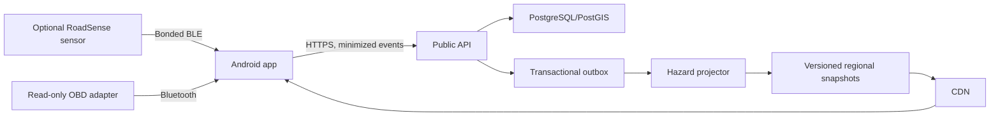

# System architecture

## Runtime components

The phone remains useful if the sensor, OBD adapter, internet connection, AI
model or backend is unavailable.

## Component boundaries

### Android

Owns:

- automatic drive-session state;
- phone IMU/GNSS road-event detection;
- device/phone event fusion;
- cached hazard warnings;
- read-only OBD transport and validation;
- deterministic vehicle/fuel/warning policy;
- local wake word, speech, explanation and TTS;
- durable client upload queue.

Does not own server consensus or municipal workflows.

### API and workers

Own:

- anonymous installation/device authentication;
- idempotent batch ingestion;
- transactional persistence and outbox;
- consensus, confidence, aging and road matching;
- versioned public regional snapshots;
- abuse prevention and operational telemetry.

The synchronous API never acknowledges an observation before the database
transaction commits.

### Firmware

Owns:

- sensor sampling/calibration;
- local road-event candidates;
- power-loss-safe event journal;
- authenticated BLE transfer and exact acknowledgements;
- device health and signed update path.

Firmware does not contain Wi-Fi credentials, shared fleet secrets, cloud
endpoints or OBD write behavior.

### Contracts

Schemas under `contracts` are the integration source of truth. Breaking changes
require a new major contract version and migration plan.

### Future emergency mesh

Crash detection and LoRa are deliberately absent from current runtime modules.
Their design is documented in the master plan and requires a future ADR after
v1 evidence gates pass.

## Initial deployment boundary

The ten-person Guwahati alpha uses minimal managed infrastructure. The read path
is still designed for future CDN distribution, but the alpha does not provision
heavy multi-region services prematurely.
